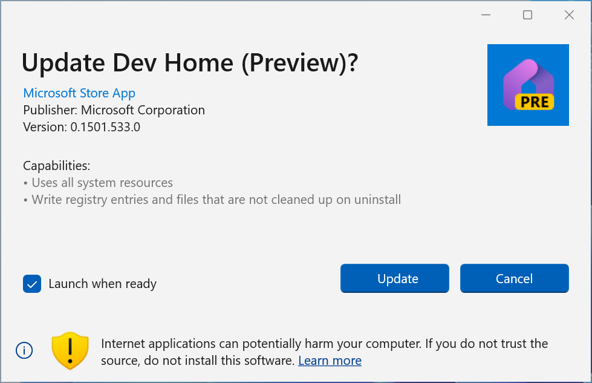
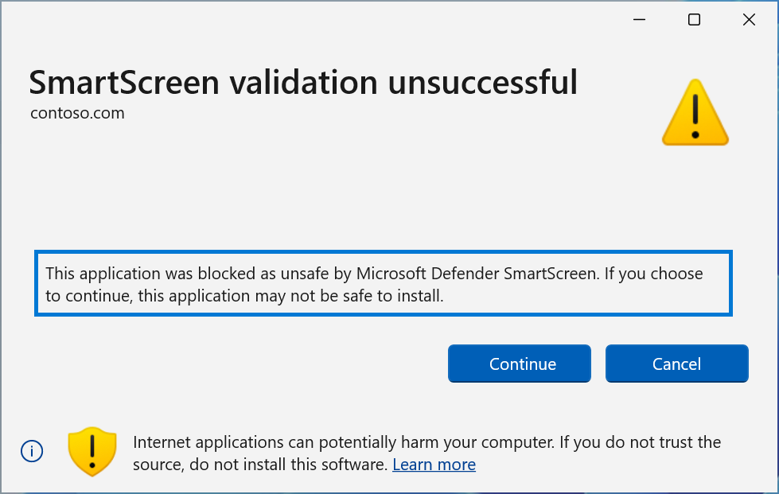
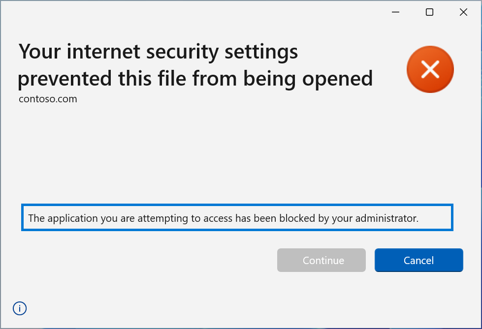

# App Installer Security Features
With build 1.24.1981 or greater of the App Installer, Microsoft introduced the following security features to ensure the robustness of the platform for users and IT Professionals:

* Internet warning
* Smart Screen Reputation-based URL Validation
* URL Security Zones

## Internet Warning
App Installer now introduces a warning bannner that will display to the user whenever the user is installing a package from the internet. When the internet warning is shown, users should be careful to verify that the source listed on the dialog is trusted.

Installing software from an untrusted site on the internet can be risky and expose you to malware and other exploits. For more information, see [Protect yourself from online scams and attacks](https://support.microsoft.com/en-us/office/protect-yourself-from-online-scams-and-attacks-0109ae3f-fe61-4262-8dce-2ee3cd43bac7)

## Smart Screen Reputation-based URL Validation
The App Installer now takes advantage of [Smart Screen](https://learn.microsoft.com/en-us/windows/security/operating-system-security/virus-and-threat-protection/microsoft-defender-smartscreen/) to help users make informed decsions before installing software.
Prior to opening a URI, App Installer will employ URL validation with Smart Screen.  

When presented with this error, the user can choose to **Cancel** or **Continue** (Not recommended).

Clicking continue will allow App Installer to open the package for installation.

## URL Security Zones
In addition to enabling and disabling the MS-AppInstaller protocol, IT Professionals can now prevent users from installing apps from URIs that the enterprise does not support. IT Pros can enable or disable URL Security Zones, and specify which domains to support. 

When a user attempts to open a blocked URL, they will be presented with the following dialog.

### Configuring App Installers Zone

**EnableMSAppInstallerProtocol**
The entry *EnableMSAppInstallerProtocol* allows the IT Professionals to enable or disable the MS-AppInstaller protocol.
Enabled: <code>HKLM:\Software\Policies\Microsoft\Windows\AppInstaller EnableMSAppInstallerProtocol=1'</code>

**EnableMsixAllowedZones**

By default, *EnableMsixAllowedZones* is enabled. If not defined, or set to "1", the App Installer will verify URL domains are allowed prior to opening the application.

Enabled: <code>'HKLM:\Software\Policies\Microsoft\Windows\AppInstaller" EnableMsixAllowedZones=1'</code>

**MsixAllowedZones**

When the *EnableMsixAllowedZones* is enabled, the App Installer will look to honor the restrictions specified in *MsixAllowedZones*. By default, the URLs in the users *UntrustedSites* security zone will be rejected.

Enabled: <code>HKLM:\Software\Policies\Microsoft\Windows\AppInstaller\MsixAllowedZones" UntrustedSites=0</code>

### Zone data

| Security Zone | Default | Detail 
| --- | --- | --- 
| Local Machine | Allow | Setting to *Blocked* will prevent any local MSIX from being installed.
| Intranet | Allow | Setting to *Blocked* will prevent files from enterprise servers from being downloaded and installed.
| Trusted Sites | Allow | Used in conjunction with Internet, allows the IT professional to allow specific Internet URIs.
| Internet | Allow | Used in conjunction with Trusted Sites, allows the IT professional to restrict installing apps from all Internet URIs.
| Untrusted Sites | Blocked | Used in conjunction with Trusted Sites, and Internet, allows the IT professional to block specific Internet URIs.

## App Installer CSP Security Zones
The App Installer access to URL Security Zones is controlled by the [DesktopAppinstaller CSP](https://learn.microsoft.com/en-us/windows/client-management/mdm/policy-csp-desktopappinstaller#enableappinstaller). If a App Installer attempts to load a URL from a zone that is blocked, the user will be presented with an error.

IT Professionals can add URLs to the users' restricted internet zones, by use of the [policy-csp-internetexplorer](https://learn.microsoft.com/en-us/windows/client-management/mdm/policy-csp-internetexplorer). If a URL appears in a zone that is blocked, the App Installer will block installation.

