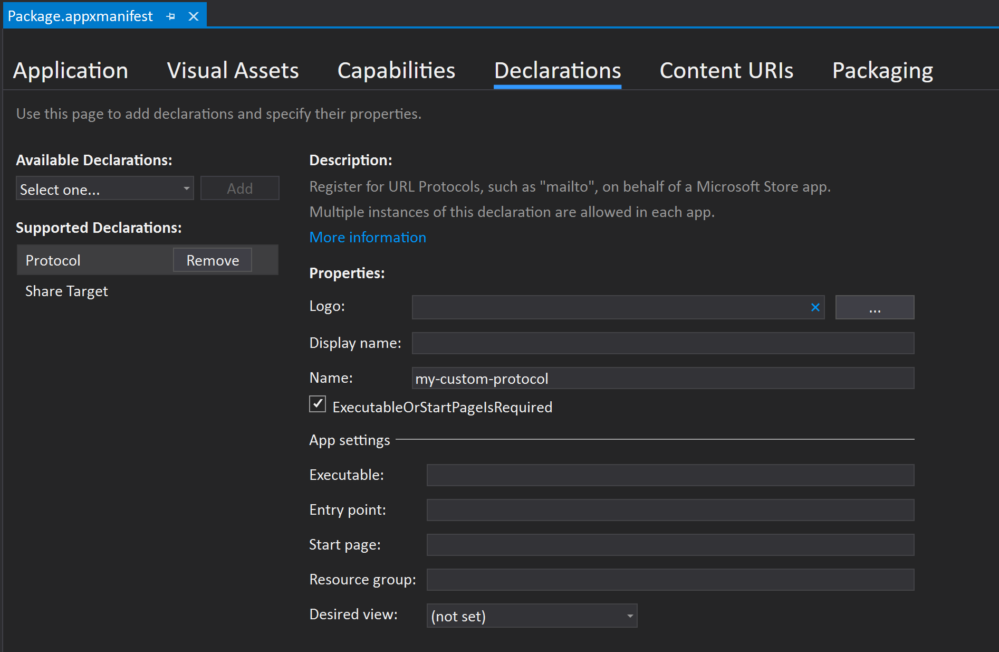

# Passing installation parameters to your app via App Installer

When distributing your app using MSIX you can configure your app such that query string parameters you define in the download/install uri are passed on to your app when it launches, after a user clicks on the download/install uri. This works whether it's the first time a user is installing the app or if the app was previously installed. 
This article shows how to configure your MSIX packaged application and its download/install uri  to take advantage of this functionality. This can be useful if you want to track or handle different installs based on the source, download type etc and will work for web downloads, and any other cases where a user clicks the uri e.g. from an email campaign. For more details check out this [blog post](https://techcommunity.microsoft.com/t5/windows-dev-appconsult/passing-installation-parameters-to-a-windows-application-with/ba-p/1719829).

## Configure your application for protocol activation

The first thing to do is to register your app for it to be launched using a [custom protocol](https://docs.microsoft.com/en-us/windows/apps/desktop/modernize/desktop-to-uwp-extensions#start-your-application-in-different-ways) you define. When this protocol is invoked, your application is launched and any prameters specified in the uri are passed to your app's activation event arguments when it is launched. You can register the protocol by adding a protocol extension entry in the Application Extensions node in your MSIX's appxmanifest.xml file:

```xml
<Application>
...
   <Extensions>
     <uap:Extension Category="windows.protocol">
        <uap:Protocol Name="my-custom-protocol"/>
     </uap:Extension>
   </Extensions>
  
...
</Application>
```

If you are using the [Windows Packaging Project](https://docs.microsoft.com/en-us/windows/msix/desktop/desktop-to-uwp-packaging-dot-net), you can also define a custom protocol using the default manifest editor by double clicking the _package.appxmanifest_ file, navigating to the _Declarations_ tab and selecting _Protocol_ under _Available Declarations_:



##  Write code to handle parameters when your app is launched after installation

You will need to implement code in your application to handle the installation parameters that will be passed to your app when it is launched. The example code below uses the [AppInstance.GetActivatedEventArgs](https://docs.microsoft.com/en-us/uwp/api/windows.applicationmodel.appinstance.getactivatedeventargs?view=winrt-19041) method to determine the type of activation used to instantiate an app (you can also handle the parameters using a different method). When your app is launched/activated with query sting parameters from an install uri (see defintion in the next section), the activation type will be a protocol activation as defined by your custom protocol declared in your appxmanifest.xml and download/install uri. The activation event args will be of type [ProtocolActivatedEventArgs](https://docs.microsoft.com/en-us/uwp/api/windows.applicationmodel.activation.protocolactivatedeventargs?view=winrt-19041) and that is what the code below uses:

```csharp

using Windows.ApplicationModel;
using Windows.ApplicationModel.Activation;

public static void Main(string[] cmdArgs)
{
            
    var activationArgs = AppInstance.GetActivatedEventArgs();
    switch (activationArgs.Kind)
    {
        //Install parameters will be passed in during a protocol activation
        case ActivationKind.Protocol:
        HandleProtocolActivation(activationArgs as ProtocolActivatedEventArgs);
        break;
        case ActivationKind.Launch:
        //Regular launch activation type
        HandleLaunch(activationArgs as LaunchActivatedEventArgs);
        break;
        default:
        break;
     }       
    

     static void HandleProtocolActivation(ProtocolActivatedEventArgs args)
     {

         if (args.Uri != null)
        {
            //Handle the installation parameters in the protocol uri
            handleInstallParameter(args.Uri.ToString());

        }
            
}
```

## Add your custom activation protocol and parameters to the installation uri

Once your app is set up to handle your installation parameters, you can customise the app download/install uri to contain uniquely defined parameters that will be passed on to your app at launch, after a user clicks on the uri. The uri must contain:

1. The [ms-appinstaller](https://docs.microsoft.com/en-us/windows/msix/app-installer/installing-windows10-apps-web#protocol-activation-scheme) protocol that invokes App Installer.
2. The unique parameter **activationUri** that points to your app's custom protocol and the install parameters you want passed to your app when it is launched.
3. Your app's custom protocol and the the parameter and its value.

In the example uris below, I have defined a custom protocol _my-custom-protocol_, a parameter _my-parameter_ and given it the value _my-param-value_. When the app is launched after a user clicks on the uri, it will receive the query string portion of the uri after **activationUri**, in this case that will be _my-custom-protocol:?my-parameter=my-param-value_.

```html
ms-appinstaller:?source=https://contoso.com/myapp.appinstaller&activationUri=my-custom-protocol:?my-parameter=my-param-value
```
```html
ms-appinstaller:?source=https://contos.com/myapp.msix&activationUri=my-custom-protocol:?my-parameter=my-param-value
```
