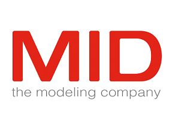

# MID GmbH

[MID GmbH](https://www.mid.de) is a German ISV and one of the leading providers of modeling solutions. MID GmbH products help companies from a wide range of sectors, from Business Process Management to Agile Consulting.

Innovator Enterprise Modeling Suite is a leading MID GmbH software package. This business tool can model and analyze information from all domains to bring data together efficiently. More than 90 customers around the world use the suite, with over 16,000 individual users. The user front-end is a complex WPF application based on .NET Framework 4.5. The application is modular, so third-party developers can develop and integrate plugins to enhance and extend the base application. The application, with a backend server that hosts data repositories and semantic configurations, lets users collaborate freely across all their models.

MID GmbH customers are mostly mid-sized to large companies, and all have dedicated client management. MID GmbH provides a MSI installer that companies can manage in a basic way by using command parameters for different installation scenarios. Due to the complexity of the configuration and the extensibility of the application, this approach presented several challenges:

- Each application release required multiple efforts from several teams. Affected teams included in-house and third-party development, client and server deployment, and support. This involvement added to the complexity and cost of each update.
- Significant delay between the release of a new version and its deployment to customers severely impacted development team agility.
- The slow release cycle reduced innovation opportunities for the company and the development team.

MID GmbH also had an overly complex deployment pipeline. To maintain security and availability of the client computers, every new or updated application had to be customer-tested. If the customer outsourced desktop client management to another company, that added more complexity and other SLAs.

MID GmbH was able to address these challenges by adopting MSIX and .NET Core. MSIX helped MID GmbH to:

- Reduce the cost of each release. MSIX lets MID tailor an installation to specific customer needs, significantly reducing support and deployment efforts.
- Improve customer agility to deploy new desktop application versions more reliably, as quickly as updating the server.
- Improve development team agility to quickly release new features to customers, and adopt the latest Windows development technologies.

MID GmbH invests heavily in innovation, by continuously improving the suite and adding new features. The inability to quickly and easily deliver new value to their customers heavily affected the outcome of these investments. Jörg Hänfling, Product Manager of Innovator Enterprise Modeling Suite, says, "From our perspective as an ISV, we see that many clients only migrate to the latest version every one or two years, which is obviously not what we would want for the investment in our product."

Jörg continues, "With the adoption of MSIX, we can drastically simplify the deployment process for our customers. Instead of having different ways of deploying the software itself, the registry settings, more plugin DLLs and additional resources like customer specific icon packs to the clients, there is now only one way to deliver everything. Having the possibility to extend an application with modification packages makes it very easy to tailor an installation to the specific needs for a customer. After you package and test your individual deployment, it is guaranteed to perform in the same way on all the other clients in the enterprise, without the need of any further manipulation. This eliminates almost any margin for error in this regard, whether technical or human, and reduces costs on both the customer’s side and ours." 

MSIX adoption also helped MID GmbH software get closer to the customer with DevOps. MID GmbH can now offer each customer an individual, specific build of their software. MID GmbH puts all plugins and resources the customer uses into a package that they build with Azure Pipelines. The customer support team hands over the package to the customer, who can install it directly on their clients.  This approach further decreases the cost of supporting customers during deployment. The development team can build and evaluate new features in a more secure and controlled way.

Migrating the solution to .NET Core also played a role in improving the suite's deployment agility. Jörg stated, "One great advantage of .NET Core is the ability to package the runtime along with the application. Especially in a deployment scenario like the one mentioned above, any dependency less is a good dependency. We also want to be able to benefit from future performance improvements of the .NET Core platform. Our developers are happy to be able to use the most recent C# functionality as soon as they see fit and not as late as the slowest customer determines."

MID GmbH has now fully migrated to .NET Core and will continue to push the application with .NET 5.0. Their goal is being able to take advantage of all the current and future innovations in Windows development.

