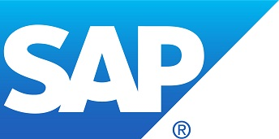

# SAP

SAP is a software corporation that makes enterprise software to manage business operations and customer relations. SAP is headquartered in Walldorf, Germany with regional offices in 180 countries. 

Like many enterprises SAP faces a challenge to find the middle ground between allowing users to easily install the Apps they need on Windows, while limiting the permissions to what the user needs on the device, to prevent users from installing non-trusted (and potential harmful) applications, which will eventually cause the all known Windows “Rot” (aka Registry Rot), and would become a bigger issues for an Enterprise, as it translates into IT support tickets for each device that’s not behaving properly and at the end might even require the device to be re-imaged.

As part of the digital transformation at SAP, and to address the previous challenge SAP has started a journey to move their Applications to a modern packaging format:  MSIX;  which is a Windows app package format that provides a modern packaging experience to all Windows apps. The MSIX package format preserves the functionality of existing app packages and/or install files in addition to enabling new, modern packaging and deployment features to Win32, WPF, and Windows Forms apps.

By leveraging MSIX and Intune capabilities, SAP will be able to deploy the LOB Applications to SAP employees while removing unneeded additional users’ privileges on Windows devices at the same time. One of their goals is to provide a consistent App deployment experience without worrying who is installing the app. Removing Admin privileges to users that don’t need to have that permission, while allowing them to install the apps they need, will help SAP reduce IT tickets for Windows Devices PCs not working after the user installs applications,

*“We have been successful in our MSIX Pilot so far and we believe it will help our organization to reduce IT support costs and improve our App delivery experience to end users.  Thanks to the team for the help for the pilot”* -Eugene Schrempf, Global Head of Workplace Delivery at SAP Americas, Inc.

