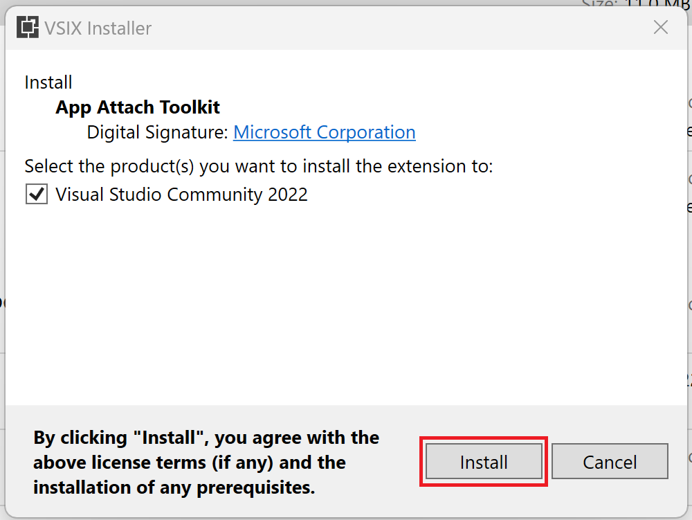
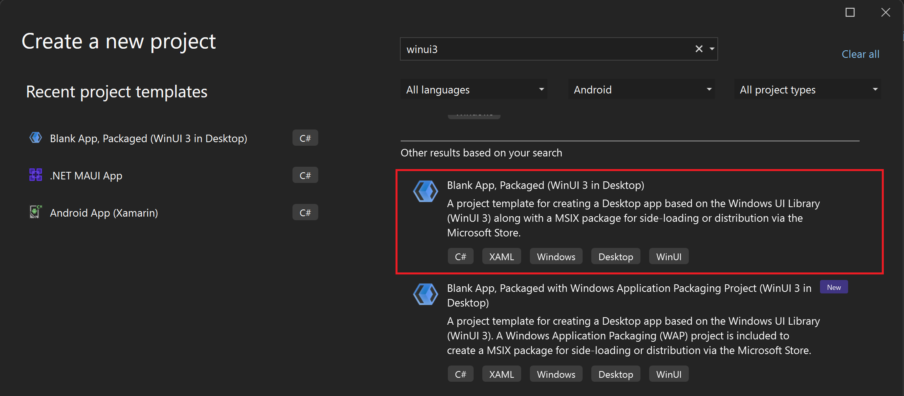
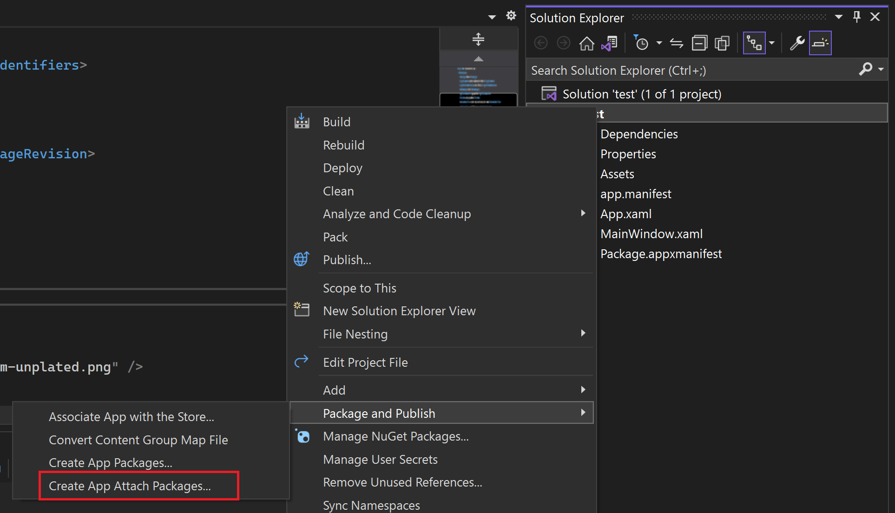
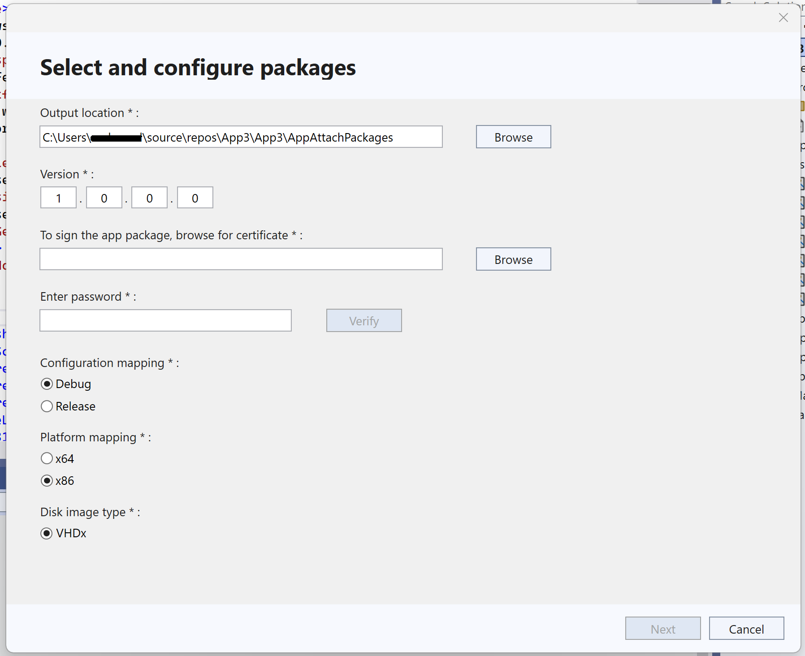
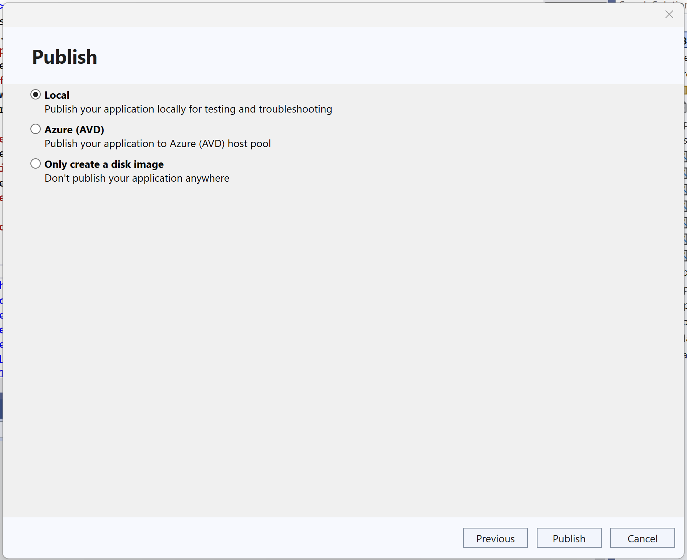
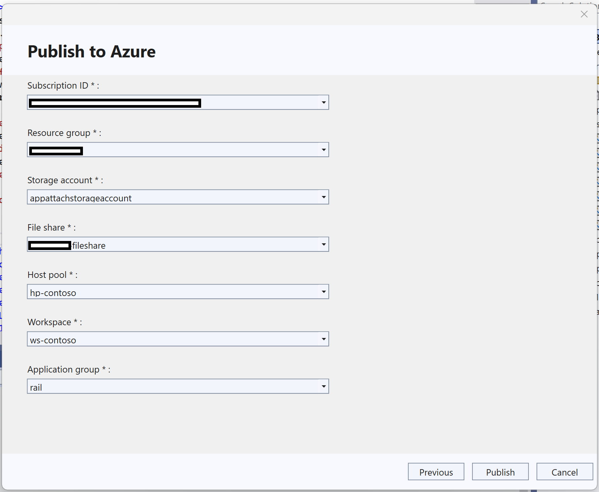

---
# Required metadata
# For more information, see https://review.learn.microsoft.com/help/platform/learn-editor-add-metadata?branch=main
# For valid values of ms.service, ms.prod, and ms.topic, see https://review.learn.microsoft.com/help/platform/metadata-taxonomies?branch=main

title:       App Attach from Visual Studio # Add a title for the browser tab
description: This article explains how to create an App Attach ready package using Visual Studio 2022 and publish it to Azure Virtual Desktop # Add a meaningful description for search results
author:      fiza-azmi # GitHub alias
ms.author:   fizaazmi # Microsoft alias
ms.topic:    conceptual # Add the ms.topic value
ms.date:     05/02/2023
---

# App Attach from Visual Studio

This article explains how to create App Attach ready packages using Visual Studio 2022, and publish it to Azure Virtual Desktop.   
  
## What is App Attach?
 
MSIX App Attach is a way to deliver MSIX applications to both physical and virtual machines. However, MSIX App Attach is different from regular MSIX because it's made especially for supported products, such as Azure Virtual Desktop.  
  
## Why App Attach?  
Enterprises prefer App Attach for:
1. Easier Windows Image management 
2. Better app manageability including lower maintenance costs and better security 

Streamed app's data roams with the user. This helps them instantly run apps and continue their experience wherever they are.  

[Local App Attach](/azure/virtual-desktop/app-attach-test-msix-packages?tabs=posh6%2Ccimfs) allows you to run MSIX applications without installing them on the device. The APIs that power Local App Attach are fully supported on Windows 11 Enterprise and Windows 10 Enterprise, baked into the OS to mount and unmount the applications. You can also use PowerShell cmdlets or scripts to automate the process. 

  
## Pre-requisite steps  

- Download and install [Visual Studio 2022](https://visualstudio.microsoft.com/vs/).
- Setup [Visual Studio for C#](/windows/apps/windows-app-sdk/set-up-your-development-environment?tabs=cs-vs-community%2Ccpp-vs-community%2Cvs-2022-17-1-a%2Cvs-2022-17-1-b).
- Configure the 'Azure development' workload in Visual Studio by the following:
  - Open Visual Studio Installer 
  - Click on **Modify**
  - Make sure that **Azure development** is selected
  - Click on **Modify** at the bottom to initiate the update.


- A functioning Azure Virtual Desktop deployment. To learn how to deploy Azure Virtual Desktop (classic), see [Create a tenant in Azure Virtual Desktop](/azure/virtual-desktop/virtual-desktop-fall-2019/tenant-setup-azure-active-directory). To learn how to deploy Azure Virtual Desktop with Azure Resource Manager integration, see [Create a host pool with the Azure portal](/azure/virtual-desktop/create-host-pools-azure-marketplace).

- Get the extension from Visual Studio Marketplace by going [here ](https://marketplace.visualstudio.com/items?itemName=AppStreamingDeveloperServices.AppAttachToolkit)or searching for "App Attach Toolkit".
- Install the extension to Visual Studio by double clicking the above downloaded file.



- Ensure the system is connected to the Internet.

> [!NOTE] 
> This extension is only compatible with Visual Studio 2022.

## Using the extension

Once you have the extension installed in Visual Studio 2022,
1. Launch Visual Studio in elevated mode by right-click and choosing 'Run as Administrator'.
1. Create a[ WinUI 3 ](/windows/apps/winui/winui3/create-your-first-winui3-app) C# or C++ Desktop app using the **Blank App, Packaged (WinUI 3 in Desktop)** Visual Studio project template that comes with the Windows App SDK.   



> [!NOTE]
> MSIX Image creation process is only supported for WinUI3 apps at this point.
1. In the Solution Explorer, right-click the project and choose __Package and Publish__ -> __Create App Attach Packages__  



1. Now you can configure the package by selecting an output location for your MSIX Package and VHDx file, and selecting the platform of choice.   
1. For an MSIX package to be installed on an end user's machine, it must be signed with a cert that is trusted on the machine. You can select a certificate from your local certificate store, select a certificate file, or create a new certificate. Learn how to [Sign the app package ](/windows/msix/package/sign-app-package-using-signtool)here.



## Features of the extension

The extension will enable developers to either create app attach ready packages, test app attach locally or publish to AVD host pool directly from Visual Studio.

You should choose the appropriate option and proceed.



### Only create a disk image

This will create an App Attach ready disk image of your app, but not publish it anywhere. It can be used to manually transfer or publish elsewhere. You can go to the specified output folder path to access the image.

### Local App Attach

This will create an App Attach ready package and publish it locally for testing and troubleshooting.

It will save the effort of attaching to AVD host for testing. Users can install the app and eject the disk post testing.

### Azure (AVD) App Attach

This will create an App Attach ready package and publish it to your AVD host pool.

1. To publish your App Attach package to Azure Virtual Desktop, select the Azure option.

> [!NOTE] 
> This extension only allows publishing to existing Azure resources.

2. Select the following values:  

- __Subscription__ **ID** – Choose the Azure subscription to use for your deployment.  
- __Resource group__ – Using the dropdown, select an existing resource group name.  
- __Storage account__ – Select your storage account name which has the deployed file share.   
- __File share__ – Select a file share in your Azure Virtual Desktop deployment where the package will be stored.  
- __Application group__ – Select the application group you want to publish the apps to.  
- __Workspace__ – Select the name of the workspace you want to assign an application group to.  
- __Host pool__ – Select the host pool name for the application group.  



1. Click on Publish to publish your package to the above Azure virtual Desktop deployment.

## Frequently Asked Questions (FAQs)
**Q1: Why did the staging fail in Local App attach, showing errors?**    
A1: The primary reason for staging failure is the absence of dependencies necessary for MSIX on the machine. To address this, carefully examine the App Attach logs, which provide detailed information about the specific dependencies required to proceed. 

**Q2: Azure Virtual Desktop: Successful App Attach Verification, Yet App Won't Launch**   
A2: The primary issue here is the absence of MSIX dependencies in the Azure Virtual Machine. To resolve this, identify the required dependencies from the App Attach logs and ensure they are installed in the designated VM(s). 

**Q3: Error: Virtual Disk Not Found at \<File Share Location\>?**   
A3: This error typically occurs when the File Share is disconnected from all VM(s). To fix this, log in to the allocated VM, and ensure the relevant File Share is connected to the VM. Afterward, you should be able to successfully mount and dismount VHDx files. 

**Q4: I have logged in Visual Studio via multiple accounts, which one shall get picked up for the AVD App Attach?**   
A4: For AVD App Attach, make sure only the AVD admin user is logged into Visual Studio. Remove any other accounts before launching the extension menu. Additionally, re-sign into Visual Studio if the credentials have expired. 

**Q5: Does the extension modify my solution?**   
A5: Yes, the extension creates the AppAttachPackages folder and `appattach.config` file at the solution's root level. The AppAttachPackages folder contains MSIX and VHDx artifacts, while the `appattach.config` file holds application metadata crucial for the App Attach process. You can safely disregard these items. 

**Q6: Can I use the extension to republish my application artifact to AVD?**   
A6: No, this functionality is not currently supported. However, you can increase the version and attempt republishing. Keep in mind that this will result in two distinct apps in the Remote Desktop Application. Additionally, you can mark the previous version as inactive in the Host Pool -> MSIX Packages section via the Azure portal. 

**Q7: How do I uninstall a locally attached application?**   
A7: Right-click on your app in the search bar and select uninstall. Also, eject the new drive added to your This PC. For a comprehensive removal, launch PowerShell in admin mode and execute the following command: 

```azurepowershell
$msixPackageFullName = <msixPackageFullName> 
Remove-AppxPackage $msixPackageFullName -PreserveRoamableApplicationData 
```

**Q8: My process is timing out during execution.**   
A8: In the `appattach.config`, locate the \<ProcessTimeOut\> tag and increase the timeout value. The default is 600 seconds (10 minutes), and you can adjust it based on your requirements. 

## See Also

- [What is MSIX App Attach?](/azure/virtual-desktop/what-is-app-attach)
- [Set up MSIX app attach with the Azure portal](/azure/virtual-desktop/app-attach-azure-portal)


