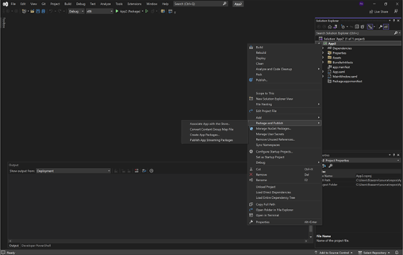

---
# Required metadata
# For more information, see https://review.learn.microsoft.com/en-us/help/platform/learn-editor-add-metadata?branch=main
# For valid values of ms.service, ms.prod, and ms.topic, see https://review.learn.microsoft.com/en-us/help/platform/metadata-taxonomies?branch=main

title:       App Attach from Visual Studio # Add a title for the browser tab
description: This article explains how to create an App Streaming package using Visual Studio 2022 and publish it to Azure Virtual Desktop # Add a meaningful description for search results
author:      fiza-microsoft # GitHub alias
ms.author:   fizaazmi # Microsoft alias
ms.topic:    conceptual # Add the ms.topic value
ms.date:     05/02/2023
---

# App Attach from Visual Studio

This article explains how to create App Attach ready packages using Visual Studio 2022 and publish it to Azure Virtual Desktop   
  
## What is App Attach?
 
MSIX app attach is a way to deliver MSIX applications to both physical and virtual machines. However, MSIX app attach is different from regular MSIX because it's made especially for supported products, such as Azure Virtual Desktop.  
  
## Why App Attach?  
Enterprises prefer App Attach for 1) easier Windows Image management 2) better app manageability including lower maintenance costs and better security. Streamed app data roams with the user. This helps them instantly run apps and continue their experience wherever they are.   
  
## Requirements:  
- Download [Visual Studio 2022](https://visualstudio.microsoft.com/vs/)   
- A functioning Azure Virtual Desktop deployment. To learn how to deploy Azure Virtual Desktop (classic), see [Create a tenant in Azure Virtual Desktop](/azure/virtual-desktop/virtual-desktop-fall-2019/tenant-setup-azure-active-directory). To learn how to deploy Azure Virtual Desktop with Azure Resource Manager integration, see [Create a host pool with the Azure portal](/azure/virtual-desktop/create-host-pools-azure-marketplace).

- Get the extension from [MSIX Developer Labs](https://microsoft.github.io/MSIX-Labs)
- [Install the extension](/visualstudio/ide/finding-and-using-visual-studio-extensions) to Visual Studio 2022  
  
> [!NOTE] 
> This extension is only compatible with Visual Studio 2022 version.

           

## Create an App Attach ready Package  
Once you have the extension installed in Visual Studio 2022,   
  
1. Create a [ WinUI 3 ](/windows/apps/winui/winui3/create-your-first-winui3-app) Desktop app using the **Blank App, Packaged (WinUI 3 in Desktop)** Visual Studio project template that comes with the Windows App SDK.   
  
Note: MSIX Image creation process is only supported for WinUI3 apps in this private preview  
  
2. Add the following tag to your project `.csproj` (C#) file  
  
<Project ...>

  ...

  < EnablePackagingAndAppAttachFlow >

  ...
    
 <Project ...>

3. In the Solution Explorer, open the solution for your application project.  

4. Right-click the project and choose __Package and Publish__->__Publish App Streaming Packages__  

5. Now you can decide how to configure the package by selecting an output location for your MSIX Package and VHDx file and selecting the platform of choice.   

6. For an MSIX package to be installed on an end user's machine, it must be signed with a cert that is trusted on the machine. You can select a certificate from your local certificate store, select a certificate file, or create a new certificate.  
Learn how to [Sign the app package ](/windows/msix/package/sign-app-package-using-signtool)here.

 

## Publish your App Attach Package

 
1. To Publish your App Attach package to Azure Virtual Desktop, select the Azure option.

> [!NOTE] 
> This extension only allows publishing to existing Azure resources.

2. Enter the following values:  
__Subscription-__ Choose the Azure subscription to use for your deployment.  
__Resource group-__ Using the dropdown, select an existing resource group name.  
__Storage account-__ Select your storage account name which has the deployed file share   
__Fileshare –__ Select a file share in your Azure Virtual Desktop deployment where the package will be stored.
__Application Group-__ Select the application group you want to publish the apps to.  
__Workspace__ - Select the name of the workspace you want to assign an application group to.  
__Host Pool__ – Select the host pool name for the application group

3. Click on Publish to publish your package to the above Azure virtual Desktop deployment.

4. You can also publish to a Folder by selecting __Folder__ on the Publish Screen. This will generate an MSIX Package and a VHDx at the specified output folder location.

 

## See Also

- [What is MSIX App Attach](/azure/virtual-desktop/what-is-app-attach)?

- [Set up MSIX app attach with the Azure portal](/azure/virtual-desktop/app-attach-azure-portal)

 

