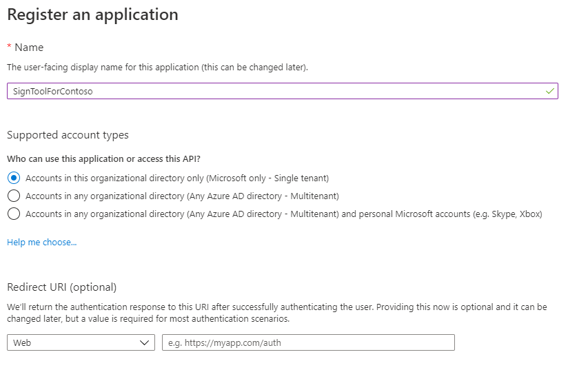
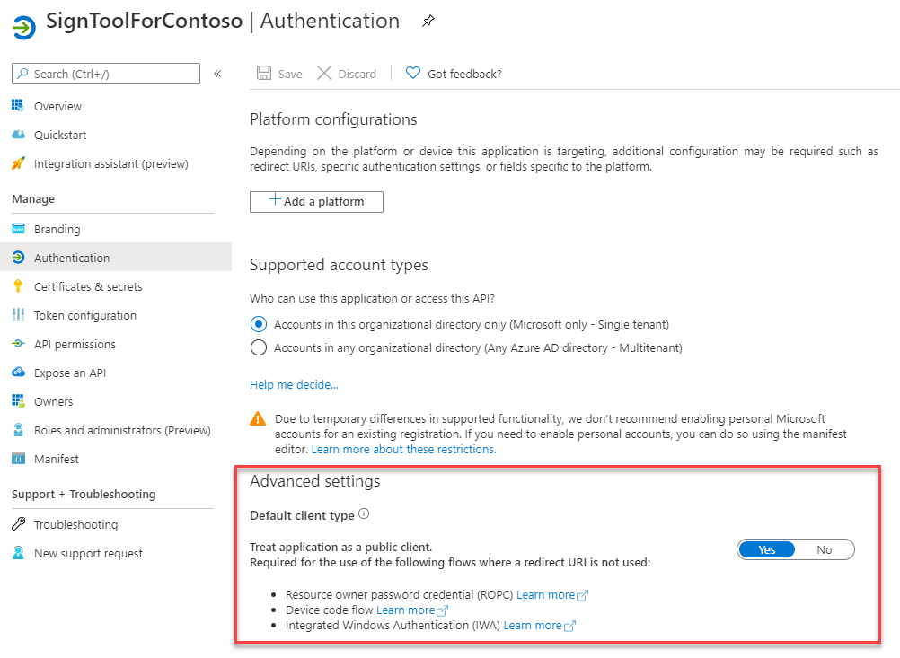
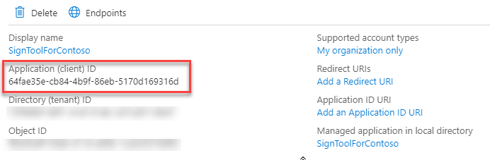
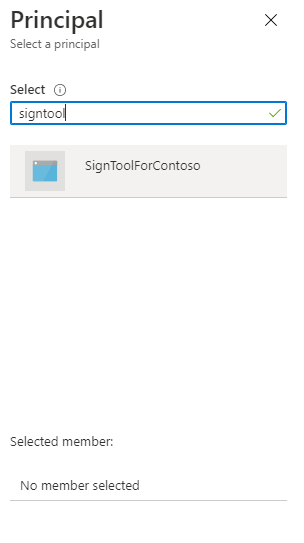
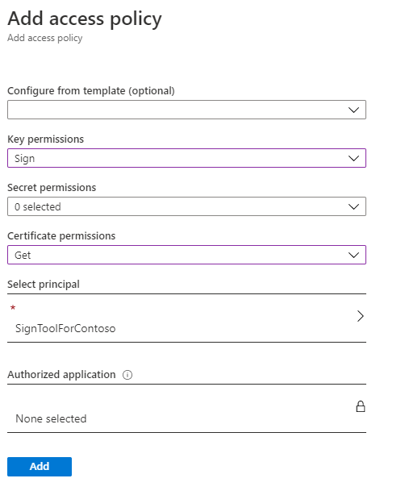
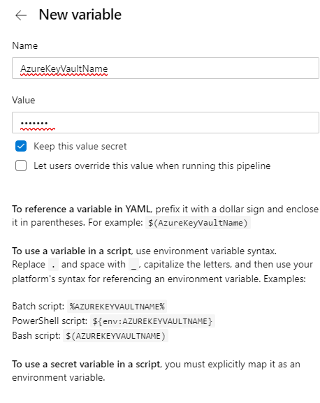

# MSIX and CI/CD Pipeline signing with Azure Key Vault

Signing is one of the critical tasks to perform when you're working with MSIX packages. If a MSIX package isn't signed with a trusted certificate, users won't be able to install the application.
At the same time, signing is one of the most critical tasks also when it comes to security. Certificates must be safely stored, to avoid that malicious actors could reuse them to sign their applications with our identity.
[Azure Key Vault](/azure/key-vault/about-keys-secrets-and-certificates) is the best option to support this requirement.

In this article we're going to see how you can leverage Azure Key Vault in a CI/CD pipeline, so that we can automatically sign our MSIX package as part of the process.

> [!IMPORTANT]
> The process described in this article is based on an open source tool called [Azure SignTool](https://github.com/vcsjones/AzureSignTool), which works both with Azure Pipelines and GitHub Actions. If you're using Azure Pipelines, you can leverage also the [MSIX Extensions](msix-packaging-extension.md) in combination with the [Azure Key  Vault task](/azure/devops/pipelines/tasks/deploy/azure-key-vault).

## Prerequisites

- An Azure account. If you do not already have an Azure account, start [here](https://azure.microsoft.com/free/).
- An Azure Key Vault. For more info, see [Create a Key Vault](/azure/key-vault/secrets/quick-create-portal#create-a-vault).
- A valid package signing certificate imported into Azure Key Vault. The default certificate generated by Azure Key Vault will not work for code signing. For details on how to create a package signing certificate, see [Create a certificate for package signing](../package/create-certificate-package-signing.md).
- A CI/CD pipeline which generates a MSIX package, hosted on Azure Pipelines or GitHub Actions. For more info, see [Configure CI/CD pipeline with YAML file](cicd-overview.md).

## Register an application on Azure

To sign the package as part of the CI/CD pipeline, we're going to use a tool called [Azure SignTool](https://github.com/vcsjones/AzureSignTool). It works like the standard SignTool utility included in the Windows 10 SDK but, instead of using a local certificate, it connects to Azure Key Vault to use one of the available certificates. To establish the connection, however, we first need to register an application on Azure, which will give us the credentials we need to enable Azure SignTool to authenticate against our Azure Key Vault service.

Open the Azure Portal and choose **Azure Active Directory** among the available services. Click on **App Registrations** and choose **New registration** to start the process.
Give a name to the application (for example, it's **SignToolForContoso** in the image below) and then leave the default settings.



The next step is to treat the application as a public client, since we are in a scenario where a redirect URI is not needed. Move to the **Authentication section** and, under **Advanced settings**, change the switch **Treat application as a public client** to **Yes**.



The last step is to create a client secret, which is the password we'll need to authenticate from the Azure SignTool. Move to the **Certificates & secrets section**, then click on **New client secret**.
Give it a name, choose an expiration and then press the **Add** button.
You will be redirected back to the main page, where the secret will be listed together with its value. Make sure to copy it and to store it somewhere safe. You won't be able to retrieve it again. As soon as you refresh the page, the secret will be masked and there won't be any way to reveal it. Your only option will be to generate a new secret.

There's one last information you need to save together with the client secret: the application identifier. Go back to the home of the application (by clicking on **Overview**) and, in the upper section, look for the value **Application (client) ID**:



## Enable access to Azure Key Vault

The next step is to configure the Azure application we have just created to access to our Azure Key Vault service.
From the Azure portal, move to the Azure Key Vault instance which holds the certificate you want to use to sign your MSIX package. Go to the **Access policies** section and click on **Add Access Policy**. The tool supports choosing one of the available templates to define the permissions we want to grant but, in our scenario, no one of them is the right fit. As such, we'll need to manually set, using the dropdowns, the following options:

- Under **Key permissions**, enable the **Sign** option.
- Under **Certificate permissions**, enable the **Get** option.

 The last important step is to specify which application is going to access to this policy. Click on **Select principal** and search for the Azure application you have created in the previous step by using its name. In the example, it's called **SignToolForContoso**.



Once you have found it, press **Select**. This is how the policy should look like.



When you have completed the process, click **Add** to create the policy.

## Use Azure SignTool to sign the package locally

Now that the Azure configuration is completed, we can use Azure SignTool to sign the package. In this section, we'll use the tool locally to familiarize with it. In the next sections, we're going to use it as part of a CI/CD pipeline.

The tool is available as a .NET global tool. Make sure to have [the latest .NET SDK installed](https://dotnet.microsoft.com/download/dotnet/5.0), then open a command prompt and launch the following command:

```text
dotnet tool install --global AzureSignTool 
```

Now you can sign your package using the AzureSignTool command, which requires the following parameters:

- `kvu` is the URL of your Azure Key Vault. You can find it in the main page of the service in the Azure portal, under DNS Name.
- `kvi` is the application id of the Azure app you have registered and that you have previously noted.
- `kvs` is the client secret you have previously generated and that you have previously noted.
- `kvc` is the friendly name of the certificate you want to use.
- `tr` is the URL of a timestamp server. By using this option, we can enable our package to work also when the certificate will expire.
- `v` is the path of the MSIX package we want to sign.

This is a sample command:

```text
AzureSignTool sign -kvu "https://contosoexpenses-blog.vault.azure.net/" -kvi "64fae35e-cb84-4b9f-86eb-5170d169316d" -kvs "this-is-the-secret" -kvc "MyCertificate" -tr http://timestamp.digicert.com -v .\MyContosoApp.msix
```

## Using Azure SignTool with Azure Pipelines

This section assumes you already have a CI/CD pipeline for a Windows application configured with a YAML file on Azure Pipelines, as explained [here](cicd-overview.md).

At first, you will need to create a few variables to store the information required by Azure SignTool to connect to Azure Key Vault.
In Azure DevOps select your pipeline and press the **Edit** button at the top. Once you are in the YAML editor, click on the **Variables** button at the top to open the panel.
You're going to click on the + button to add the following variables:

- **AzureKeyVaultName**, with the friendly name of your vault.
- **AzureKeyVaultUrl**, with the URL of your vault.
- **AzureKeyVaultClientId**, with the application id of your Azure application.
- **AzureKeyVaultClientSecret**, with the client secret of your Azure application.

When you create each variable, make sure to enable the **Keep this value** secret option. It will make sure that other people who have access to the pipeline won't be able to see their values.



Now you can customize your existing YAML pipeline by adding a .NET Core task to install Azure SignTool on the agent. This is the YAML to add:

```yaml
- task: DotNetCoreCLI@2
  displayName: 'Install Azure SignTool'
  inputs:
    command: custom
    custom: tool
    arguments: 'install --global AzureSignTool'
```

The next step is to add a PowerShell task to execute the command that will sign the package. You must perform this task only at the end of the build process, once the MSIX package has been created.

```yaml
- powershell: '& AzureSignTool sign -kvu $(AzureKeyVaultUrl) -kvi $(AzureKeyVaultClientId) -kvs $(AzureKeyVaultClientSecret) -kvc $(AzureKeyVaultName) -tr http://timestamp.digicert.com -v "$(System.DefaultWorkingDirectory)\MyPipeline\MyContosoApp\MyContosoApp.msix"'
  displayName: 'Sign the package'
```

The command is similar to the one we have used to sign the package locally. The only differences are:

- Instead of using fixed values for the various parameters, we're using the variables we have created with the syntax **$(Variable-Name)**
- The path of the MSIX package points to the folder on the agent where the MSIX package is created at the end of the build.

## Using Azure SignTool with GitHub Actions

This section assumes you already have a CI/CD pipeline for a Windows application configured with a YAML file on GitHub Actions, as explained [here](https://github.com/microsoft/github-actions-for-desktop-apps).

As first step, like we did on Azure Pipeline, we need to safely store the credentials. GitHub uses **secrets** and they can be added in the settings of your repository. Once you're on the GitHub repository which hosts your Windows application, click on **Settings** then move to **Secrets**.

Similarly to what you did with Azure Pipelines, you're going to click on **New secret** to create four secrets:

- **AzureKeyVaultName**, with the friendly name of your vault.
- **AzureKeyVaultUrl**, with the URL of your vault.
- **AzureKeyVaultClientId**, with the application id of your Azure application.
- **AzureKeyVaultClientSecret**, with the client secret of your Azure application.

The difference with Azure Pipeline is that secrets are implicitly hidden, so you won't have to enable any option to protect them.

Now, through the **Actions** tab of your repository, you can open your existing workflow and add the tasks you need to perform the signing.
The first one will install AzureSign Tool on the agent:

```yaml
- name: Install AzureSignTool
  run: dotnet tool install --global AzureSignTool
```

The second one will sign the package and, as such, it must be executed after the Visual Studio build has been completed and the MSIX package has been generated.

```yaml
 - name: Sign package
   run: |
        Get-ChildItem -recurse -Include **.msix | ForEach-Object {
        $msixPath = $_.FullName
        & AzureSignTool sign -kvu "${{ secrets.AzureKeyVaultUrl }}" -kvi "${{ secrets.AzureKeyVaultClientId }}" -kvs "${{ secrets.AzureKeyVaultClientSecret }}" -kvc ${{ secrets.AzureKeyVaultName }} -tr http://timestamp.digicert.com -v $msixPath
        }
```

There are a few differences in this task compared to the one we used in Azure Pipelines. The first one is that GitHub uses a different syntax to access to the secrets, which is ${{ secrets.SECRET_NAME }}. As such, the various parameters are filled with the values we have previously created in the Secrets section.
The other one is that you need to use a different approach to find the MSIX packages to sign. The task, instead of pointing to a specific MSIX package, uses a PowerShell script which iterates through all the files stored in the build output. If the file has the MSIX extension, then it will use the AzureSignTool command to sign it.

## Deploy the package

Regardless of the CI/CD platform of your choice, at the end of the flow you will have a MSIX package signed with your certificate stored on Azure Key Vault. Now you can use any other available task to deploy the package using your preferred choice of distribution: the Microsoft Store, a website, Microsoft Intune, etc.