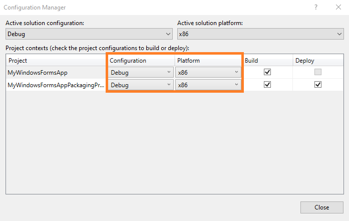

# Setup your Desktop application for MSIX packaging in Visual Studio

You can use the **Windows Application Packaging Project** project in Visual Studio to generate a package for your desktop app. Then, you can publish that package to the Microsoft Store or sideload it onto one or more PCs.

The **Windows Application Packaging Project** project is available in the following versions of Visual Studio. For the best experience, we recommend that you use the latest release.

* Visual Studio 2019
* Visual Studio 2017 15.5 and later

> [!IMPORTANT]
> The **Windows Application Packaging Project** project in Visual Studio is supported on Windows 10, version 1607, and later. It can only be used in projects that target Windows 10 Anniversary Update (10.0; Build 14393) or a later release.

Here are a few other things you can do from the Visual Studio Application Packaging Project:

:heavy_check_mark: Automatically generate visual assets.

:heavy_check_mark: Make changes to your manifest by using a visual designer.

:heavy_check_mark: Generate your package by using a wizard.

:heavy_check_mark: Easily assign an identity to your application from a name that you've already reserved in [Partner Center](https://partner.microsoft.com/dashboard).


## Prepare your application

Review this guide before you begin creating a package for your application: [Prepare to package a desktop application](desktop-to-uwp-prepare.md).

<a id="new-packaging-project"/>

## Setup the Windows Application Packaging Project in your solution

1. In Visual Studio, open the solution that contains your desktop application project.

2. Add a **Windows Application Packaging Project** project to your solution.

   You won't have to add any code to it. It's just there to generate a package for you. We'll refer to this project as the "packaging project".

   

3. Set the **Target Version** of this project to any version that you want, but make sure to set the **Minimum Version** to **Windows 10 Anniversary Update**.

   

4. In Solution Explorer, right-click the **Applications** folder under the packaging project and choose **Add Reference**.

   

5. Choose your desktop application project, and then choose the **OK** button.

   

   You can include multiple desktop applications in your package, but only one of them can start when users choose your app tile. In the **Applications** node, right-click the application that you want users to start when they choose the app's tile, and then choose **Set as Entry Point**.

   

6. If the application you are packaging targets .NET Core 3, follow these steps to add a new build target to the project file. This is only necessary for applications that target .NET Core 3.  

    1. In Solution Explorer, right-click the packaging project node and select **Edit Project File**.

    2. Locate the `<Import Project="$(WapProjPath)\Microsoft.DesktopBridge.targets" />` element in the file.

    3. Replace this element with the following XML.

        ``` xml
        <ItemGroup>
          <SDKReference Include="Microsoft.VCLibs,Version=14.0">
            <TargetedSDKConfiguration Condition="'$(Configuration)'!='Debug'">Retail</TargetedSDKConfiguration>
            <TargetedSDKConfiguration Condition="'$(Configuration)'=='Debug'">Debug</TargetedSDKConfiguration>
            <TargetedSDKArchitecture>$(PlatformShortName)</TargetedSDKArchitecture>
            <Implicit>true</Implicit>
          </SDKReference>
        </ItemGroup>
        <Import Project="$(WapProjPath)\Microsoft.DesktopBridge.targets" />
        <Target Name="_StompSourceProjectForWapProject" BeforeTargets="_ConvertItems">
          <ItemGroup>
            <_TemporaryFilteredWapProjOutput Include="@(_FilteredNonWapProjProjectOutput)" />
            <_FilteredNonWapProjProjectOutput Remove="@(_TemporaryFilteredWapProjOutput)" />
            <_FilteredNonWapProjProjectOutput Include="@(_TemporaryFilteredWapProjOutput)">
              <SourceProject>
              </SourceProject>
            </_FilteredNonWapProjProjectOutput>
          </ItemGroup>
        </Target>
        ```

    4. Save the project file and close it.

7. Build the packaging project to ensure that no errors appear. If you receive errors, open **Configuration Manager** and ensure that your projects target the same platform.

   

8. Use the [Create App Packages](../package/packaging-uwp-apps.md) wizard to generate an MSIX package/bundle (for sideloading) or an .msixupload/.appxupload file to distribute to the Store.


**Video**

&nbsp;
> [!VIDEO https://www.youtube-nocookie.com/embed/fJkbYPyd08w]

## Next steps

**Find answers to your questions**

Have questions? Ask us on Stack Overflow. Our team monitors these [tags](https://stackoverflow.com/questions/tagged/project-centennial+or+desktop-bridge). You can also ask us [here](https://social.msdn.microsoft.com/Forums/en-US/home?filter=alltypes&sort=relevancedesc&searchTerm=%5BDesktop%20Converter%5D).

**Run, debug or test your desktop application**

See [Run, debug, and test a packaged desktop application](desktop-to-uwp-debug.md)

**Enhance your desktop application by adding UWP APIs**

See [Enhance your desktop application for Windows 10](https://docs.microsoft.com/windows/apps/desktop/modernize/desktop-to-uwp-enhance)

**Extend your desktop application by adding UWP projects and Windows Runtime Components**

See [Extend your desktop application with modern UWP components](https://docs.microsoft.com/windows/apps/desktop/modernize/desktop-to-uwp-extend).

**Distribute your app**

See [Distribute a packaged desktop application](https://docs.microsoft.com/windows/apps/desktop/modernize/desktop-to-uwp-distribute)
