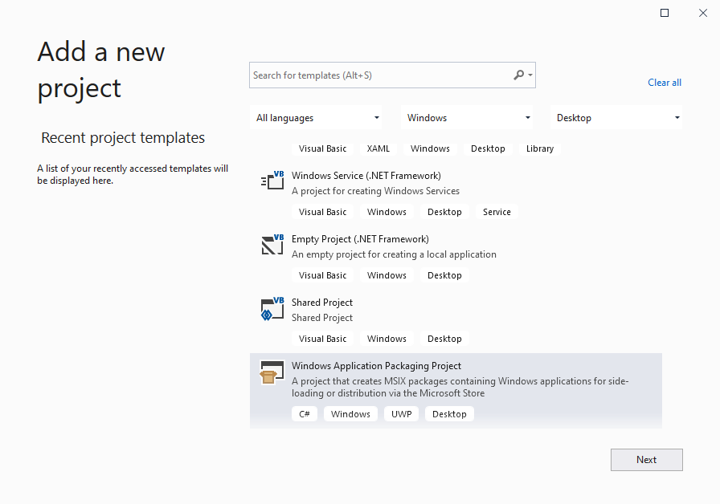
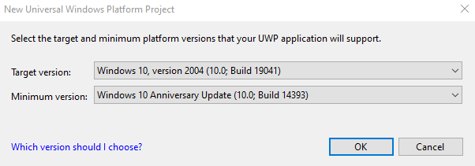
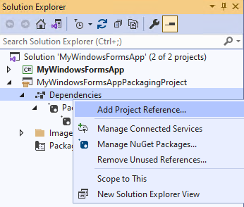
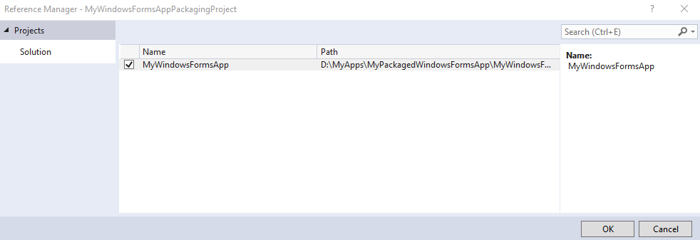
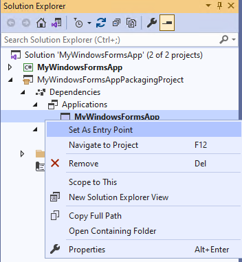

# Set up your desktop application for MSIX packaging in Visual Studio

* If your desktop app is a WinUI 3 app, then see [Package your app using single-project MSIX](/windows/apps/windows-app-sdk/single-project-msix). A WinUI 3 app is one that uses the [Windows UI Library (WinUI) 3](/windows/apps/winui/winui3/) framework for its user interface (UI); and it uses the Windows App SDK.
* But for all other kinds of desktop app, continue reading this topic.

You can use the **Windows Application Packaging Project** project in Visual Studio to generate a package for your desktop app. Then you can distribute your package to the Microsoft Store, on the Web, in your enterprise or any other distribution mechanism you're using.

## Required Visual Studio version and workload

The **Windows Application Packaging Project** project is available in Visual Studio 2017 15.5 and later.

To see the Windows Application Packaging Project template in the 'Add New Project' menu, you need to make sure you have **at least one** of the following the Visual Studio workloads installed:

* The 'Universal Windows Platform development' workload
* The Optional Component 'MSIX Packaging Tools' in the NET Core workload.
* The Optional Component 'MSIX Packaging Tools' in the .NET desktop development workload.

 For the best experience we recommend that you use the latest Visual Studio release.

> [!IMPORTANT]
> The **Windows Application Packaging Project** project in Visual Studio is supported on Windows 10, version 1607, and later. It can only be used in projects that target Windows 10 Anniversary Update (10.0; Build 14393) or a later release.

Here are a few other things you can do from the Visual Studio Application Packaging Project:

:heavy_check_mark: Automatically generate visual assets.

:heavy_check_mark: Make changes to your manifest using a visual designer.

:heavy_check_mark: Generate your package or bundle using a wizard.

:heavy_check_mark: (If publishing to the Microsoft Store) Easily assign an identity to your application from a name that you've already reserved in [Partner Center](https://partner.microsoft.com/dashboard).

## Prepare your application

Review this guide before you begin creating a package for your application: [Prepare to package a desktop application](desktop-to-uwp-prepare.md).

<a id="new-packaging-project"></a>

## Set up the Windows Application Packaging Project in your solution

1. In Visual Studio, open the solution that contains your desktop application project.

> [!NOTE]
> If you want to package your project in x64 configuration, make sure you have configured referenced project to x64. To confirm this, refer to Additional notes below.
2. Add a **Windows Application Packaging Project** project to your solution, choosing the appropriate language (C# or C++) that matches the language of your existing dekstop app's project.

   You won't have to add any code to the packaging project. Its purpose is only to generate and configure a package for you. We'll refer to this project as *the packaging project*.

   

3. Set the **Target Version** of this project to any version that you want, but make sure to set the **Minimum Version** to not lower than **Windows 10 Anniversary Update**.

   

4. In Solution Explorer, right-click the **Dependencies** folder under the packaging project and choose **Add Project Reference...**.

   

5. Choose your desktop application project, and then choose the **OK** button.

   

   You can include multiple desktop applications in your package, but only one of them can start when users choose your app tile. In the **Applications** node, right-click the application that you want users to start when they choose the app's tile, and then choose **Set as Entry Point**.

   

6. Build the packaging project to ensure that no errors appear. If you receive errors, open **Configuration Manager** and ensure that your projects target the same platform.

   

7. Use the [Create App Packages](../package/packaging-uwp-apps.md) wizard to generate an MSIX package/bundle or an .msixupload/.appxupload file (for Store publishing to the Store).

## Additional notes

To build WAP for x64 platform, follow either of the following steps:

__Approach 1:__ Before adding the WAP project on any of the project, add x64 architecture via configuration manager (as shown in the screenshot below).

.png)

__Approach 2:__ For the existing projects where WAP has been added, 

1. Remove the x64 entries from .sln files entry manually. 


``` 
_Global_
_GlobalSection(SolutionConfigurationPlatforms) = preSolution_
_Debug|Any CPU = Debug|Any CPU_
_Debug|ARM = Debug|ARM_
_Debug|ARM64 = Debug|ARM64_ (remove)
_Debug|x64 = Debug|x64_ (remove)
_Debug|x86 = Debug|x86_
_Release|Any CPU = Release|Any CPU_
_Release|ARM = Release|ARM_
_Release|ARM64 = Release|ARM64_ (remove)
_Release|x64 = Release|x64_ (remove)
_Release|x86 = Release|x86"_
```

2. After step1, add x64 configurations via configuration manager.

## Next steps

**Package your desktop app in Visual Studio**

See [Package a Desktop or UWP app in Visual Studio](../package/packaging-uwp-apps.md)

**Run, debug or test your desktop application**

See [Run, debug, and test a packaged application](desktop-to-uwp-debug.md)

## Additional resources

**Enhance your desktop application by adding UWP APIs**

See [Enhance your desktop application for Windows 10](/windows/apps/desktop/modernize/desktop-to-uwp-enhance)

**Extend your desktop application by adding UWP projects and Windows Runtime Components**

See [Extend your desktop application with modern UWP components](/windows/apps/desktop/modernize/desktop-to-uwp-extend).

**Distribute your app**

See [Distribute a packaged desktop application](/windows/apps/desktop/modernize/desktop-to-uwp-distribute)

