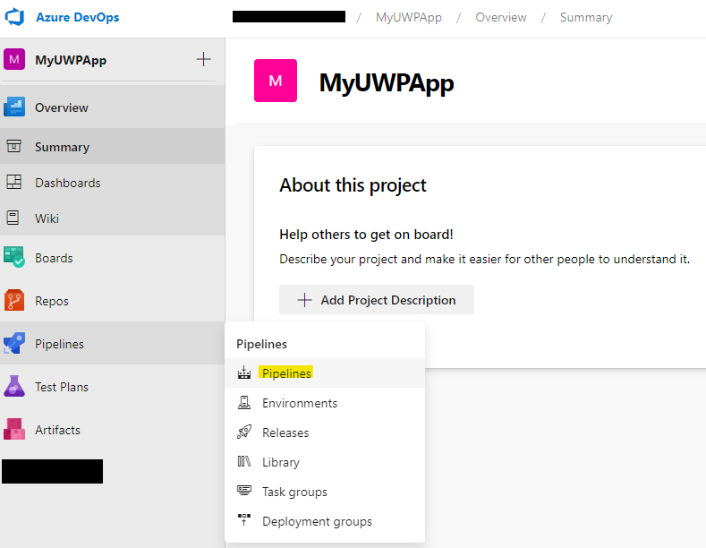
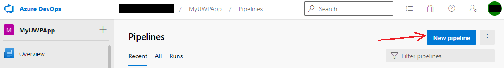
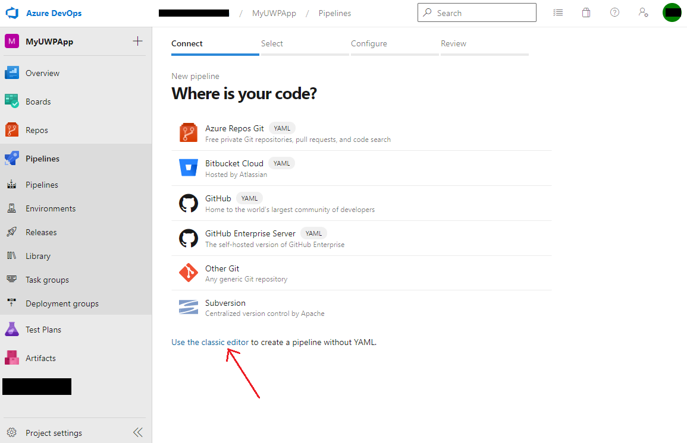
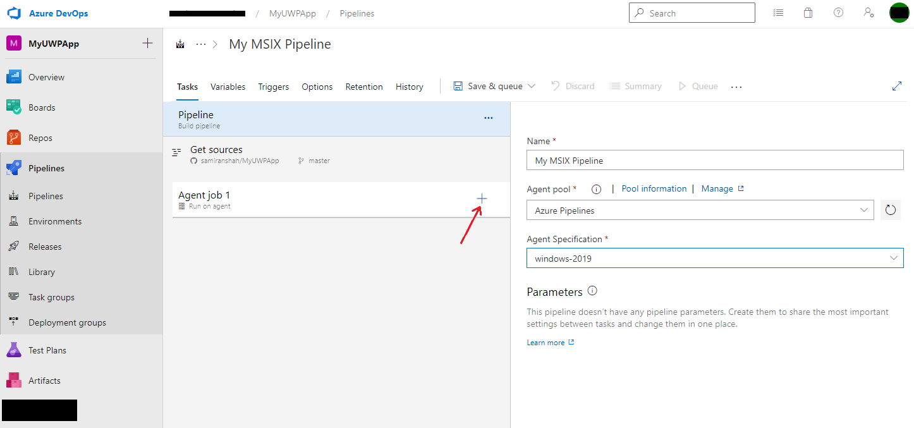
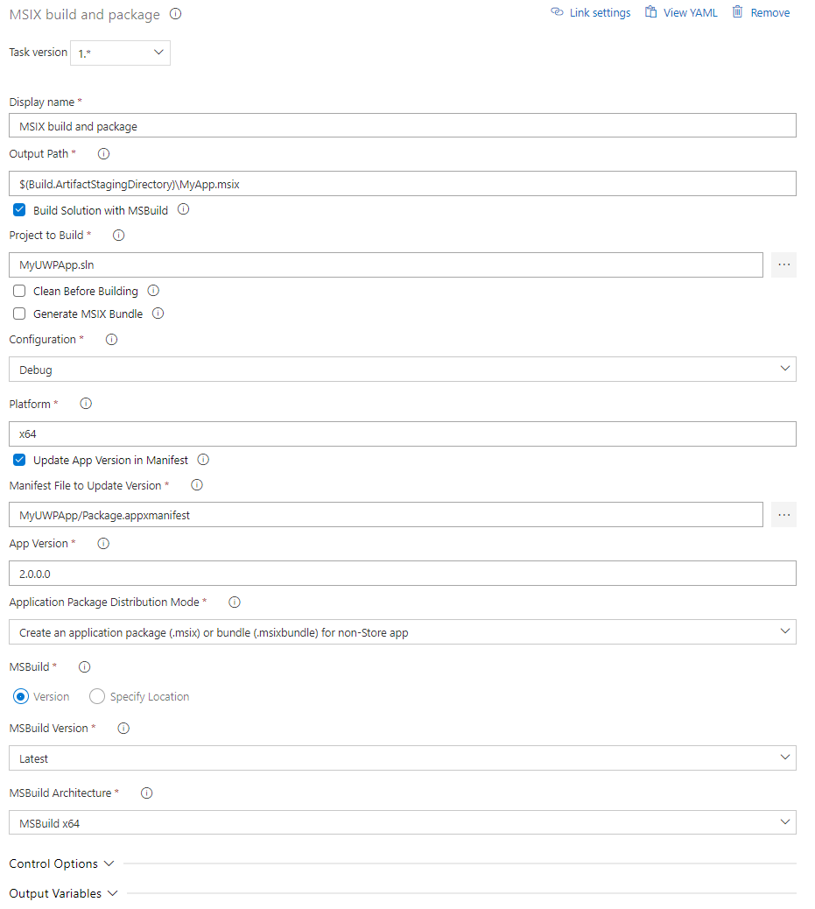
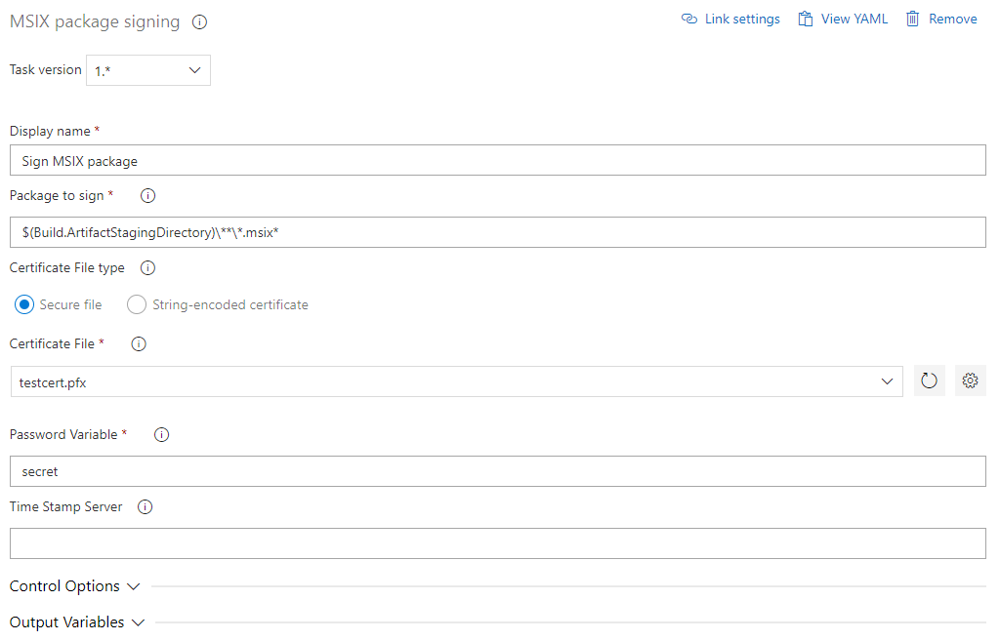
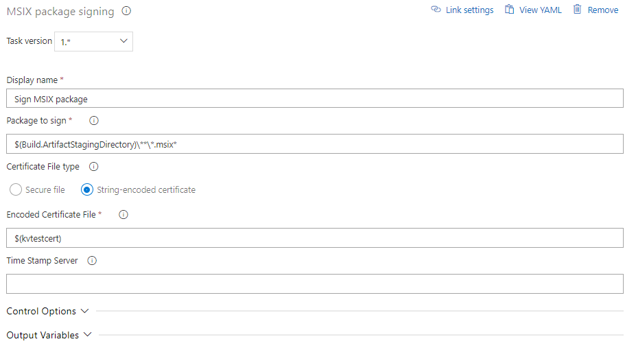

# MSIX Packaging Extension

The *MSIX Packaging* Extension is an Azure DevOps extension which helps build, package and sign Windows apps using the MSIX package format.

CI/CD workflows have become an integral part of the development process to improve efficiency and quality while reducing cost and time to market. Microsoft's CI/CD solution Azure DevOps Pipelines is widely adopted and popular, but the current process of integrating build and deployment workflows for apps that need to be packaged as MSIX into Azure Pipelines is tedious, specifically for people that are not Azure Pipelines or MSIX experts. This Azure DevOps extension offers a straightforward and intuitive solution making it easier to automate build and deployment process for apps being packaged as MSIX, and for apps with existing CI/CD workflows to move to MSIX without disrupting their build and deployment mechanisms.

The *MSIX Packaging* Extension contains the following tasks that you can use to custom build your pipeline according to your requirements:

1. **MSIX build and package** - to build and package Windows apps using the MSIX package format
2. **MSIX package signing** - to sign MSIX packages using a trusted certificate
3. **App installer file for MSIX** - to create or update a .appinstaller file for MSIX apps
4. **Create package for MSIX app attach** - to create a VHDX package for MSIX app attach

## Install the extension

Browse the Azure DevOps Marketplace and look for the extension name *MSIX Packaging* Extension.


## Create a Pipeline

Create a new pipeline for your Azure DevOps project.





Select the option to *Use the classic editor to create a pipeline without YAML*.



Select your version control system and provide your repository and default branch details.


When asked to *Select a template*, click *start with an **Empty job***.


Change your *Agent Specification* selection to ***windows-2019*** since the MSIX extension runs only on a Windows agent.



You should see *Agent job 1* by default in your pipeline. Click on the plus symbol to *Add a task to Agent job 1*.

Search for ***MSIX*** in the *Add tasks* search bar and you should see the tasks mentioned before in the *MSIX Packaging* Extension. You can custom build your pipeline by adding the tasks you need according to your requirements. But we will demonstrate how to configure all four tasks on this page.


### MSIX build and package

Note: If you are trying to build a packaged app using this task, you will need to [include the Windows Application Packaging Project](./desktop-to-uwp-packaging-dot-net.md), because the task needs the Package.appxmanifest file. The task will not add it automatically for you.

#### [YAML](#tab/yaml/)
Here's an example that shows how to configure the build and package task in the yaml file:

```yaml
steps:
- task: MSIX.msix-ci-automation-task-dev.msix-packaging.MsixPackaging@1
  displayName: 'MSIX build and package'
  inputs:
    outputPath: '$(Build.ArtifactStagingDirectory)\MyApp.msix'
    solution: MyUWPApp.sln
    buildPlatform: x64
    updateAppVersion: true
    manifestFile: MyUWPApp/Package.appxmanifest
    appVersion: 2.0.0.0
    appPackageDistributionMode: SideloadOnly
    msbuildArchitecture: x64
```
#### [UI](#tab/UI/)


- **Display name** - Customize your task name
- **Output Path** - Specify the output path for the MSIX package that will be created by this task. The path in the example above uses [predefined variable](/azure/devops/pipelines/build/variables) **Build.ArtifactStagingDirectory** which is the local path on the agent to store artifacts, and is used here to store task output files which can later be published using a publish artifacts task.
- **Build Solution with MSBuild** - Select this option to build your solution with msbuild for the specified target platform. Leave the box unchecked if you already have binaries that just need to be packaged. If you leave the box unchecked, you will be asked to provide the path to your binaries.
- **Project to Build** - Provide the path to your project or solution file that needs to be built.
- **Clean before Building** - Select this checkbox if you want the task to run a clean build prior to the build.
- **Generate MSIX Bundle** - Select this checkbox to generate an MSIX bundle instead of a package. Make sure to name your output file in the **Output Path** option with a .msixbundle extension instead of .msix.
- **Configuration** - Choose between *Debug* and *Release* build configurations.
- **Platform** - Specify the target build platform, for example, *x64*, *x86*, *Any CPU*.
- **Update App Version in Manifest** - Select this checkbox to change the app version from the one specified in the app's .appxmanifest file. This will not overwrite the .appxmanifest file, but change the app version in the generated output MSIX package. If this option is selected, you will be asked to provide the path to the manifest file, and the app version number to set for the app.
- **Application Package Distribution Mode** - Select the mode from the dropdown menu to generate a Store app package or non-Store app package.
- **MSBuild Version and Architecture** - Customize your MSBuild by specifying advanced options.


***

### MSIX package signing

The signing task allows signing using a certificate. The certificate can come from the [Secure Files library](/azure/devops/pipelines/library/secure-files) , or be encoded as a string as if fetched with the [Azure Key Vault task](/azure/devops/pipelines/tasks/deploy/azure-key-vault).

#### [YAML](#tab/yaml/)
Here's an example that shows how to configure the package signing task in the yaml file:

```yaml
steps:
- task: MSIX.msix-ci-automation-task-dev.msix-signing.MsixSigning@1
  displayName: 'Sign MSIX package'
  inputs:
    certificateType: base64
    encodedCertificate: '$(kvtestcert)'
```

#### [UI](#tab/UI/)
This example shows the task when the source of the certificate is the Secure Files Library.


This example shows the task when the source of the certificate is an Azure Key Vault.


- **Display name** - Customize your task name
- **Package to sign** - The MSIX package signing task uses SignTool to sign all files matching this path, regardless of whether they are MSIX packages or bundles.
- **Certificate file type** - Select the source of the certificate file to use.
- **Time Stamp Server** - A URL that specifies the address of a time stamping server. This is an optional parameter.


***

### App installer file for MSIX

#### [YAML](#tab/yaml/)
Here's an example that shows how to configure the AppInstaller file task in the yaml file:

```yaml
steps:
- task: MSIX.msix-ci-automation-task-dev.app-installer-file.AppInstallerFile@1
  displayName: 'Create App Installer file'
  inputs:
    package: '$(Build.ArtifactStagingDirectory)\MyApp.msix'
    outputPath: '$(Build.ArtifactStagingDirectory)\MyApp.appinstaller'
    uri: 'https://myuwpapp-demo.azurewebsites.net/MyApp.appinstaller'
    mainItemUri: 'https://myuwpapp-demo.azurewebsites.net/MyApp.msix'
    showPromptWhenUpdating: true
    updateBlocksActivation: true
```

#### [UI](#tab/UI/)


- **Display name** - Customize your task name
- **Package** - This is the path to the package or bundle you want to create an App Installer for.
- **Output File Path** - This is the path of the App Installer file to be written.
- **Method to Create App Installer File** - Choose whether to create a new App Installer file or update an existing one. If you choose to update an existing one, you will be asked to provide the path to the existing App Installer file.
- **Version for App Installer file** - The version number which will be given. Must take the form (*major*).(*minor*).(*build*).(*revision*).
- **URI** - Web URI to the redirected App Installer file.
- **Main Package/Bundle URI** - URI to the app package/bundle location.
- **Update On Launch** - Select this to set the app to check for updates when launched. If this checkbox is selected, you will be asked to provide details like *Hours Between Update Checks*, whether to *Show UI to User when Updating*, and whether you want the *Update to Block App Activation*.


***

### Create package for MSIX app attach

#### [YAML](#tab/yaml/)
Here's an example that shows how to configure the task to create a VHDX file for app attach in the yaml file:

```yaml
steps:
- task: MSIX.msix-ci-automation-task-dev.msix-app-attach.MsixAppAttach@1
  displayName: 'Create package for MSIX app attach'
  inputs:
    package: '$(Build.ArtifactStagingDirectory)\MyApp.msix'
    vhdxOutputPath: '$(Build.ArtifactStagingDirectory)\MyApp.vhdx'
```

#### [UI](#tab/UI/)


- **Display name** - Customize your task name.
- **Package Path** - This is the path to the MSIX package/bundle.
- **VHDX Output Path** - This is the path of the VHDX file that will be created by the task.
- **VHDX size** - The maximum size in MBs of the VHDX.

After configuring all the tasks, you can use a *Publish build artifacts* task to drop all the artifacts from the temp location to Azure Pipelines artifacts or a file share of your choice.

***

### Publish MSIX app attach package to AVD

#### [YAML](#tab/yaml/)
Here's an example that shows how to configure the avd app attach task in the yaml file: 

```yaml
steps:
- task: MSIX.msix-ci-automation-task-dev.avd-app-attach-publish.AVDAppAttachPublish@0
  displayName: 'Publish MSIX app attach package to AVD'
  inputs:
    vhdxPath: '$(Build.ArtifactStagingDirectory)/App.vhdx' 
    connectedServiceNameARM: 'ed1db943-1e1c-4eac-8683-ead2abc281b5' 
    resourceGroupName: 'appattach-test-rg' 
    storageAccount: 'appattachteststorage' 
    fileShare: 'appattach-test-fs' 
    hostPool: 'appattach-hostpool' 
    workSpace: 'appattach-test-ws' 
    applicationGroup: 'appattach-test-ag-rail' 
```

#### [UI](#tab/UI/)


- **Display name** - Customize your task name.
- **Package Path** - This is the path to the MSIX package/bundle.
- **VHDX Output Path** - This is the path of the VHDX file that will be created by the task.
- **VHDX size** - The maximum size in MBs of the VHDX.

- **Display name** - Customize your task name. 
- **VHDX Path** - This is the path of the VHDX file that will be app attached(publish) to Azure Virtual Desktop (AVD). 
- **Azure Subscription** - This is the service connection to target azure subscription that your application needs to be app attached. Drop down lists all the azure subscriptions available to the current ADO logged in user and user can select any of these and establish service connection to it. 

Resource Group - Choose the resource group that your app needs to be published. This resource group should contain all the target resources that are required for app attach, like storage account, host pool, workspace, application group. 

This drop-down lists all the resource groups available under the selected  		Azure subscription 

Storage account - Choose the storage account that you application (or VHDX) is to be uploaded. 

This drop-down lists all the storage accounts available under selected 	   	resource group. 

File share - Choose the file share in the selected storage account that your application (or VHDX) is to be uploaded.  

This drop-down lists all the file share available under the selected storage 		account. 

Host pool - Choose the host pool that is to be used for app attaching the application.                                                                                                      This drop-down list all the host pools available under the selected resource group. 

Workspace – Choose the workspace that is to be used for app attaching the application.                                                                                                       This drop-down list all the workspaces available under the selected resource group. 

Application group – Choose the application group that is to be used for app attaching the application.                                                                                 This drop-down list all the application groups available under the selected resource group. 

After configuring all the tasks, you can use a *Publish build artifacts* task to drop all the artifacts from the temp location to Azure Pipelines artifacts or a file share of your choice.

***

## Ways to provide Feedback

We would love to hear your feedback on the *MSIX Packaging* Extension. Reach out to us via the following channels:

- Review the extension on Azure DevOps Marketplace
- [MSIX Tech Community](https://techcommunity.microsoft.com/t5/msix/ct-p/MSIX)
- [GitHub open source project](https://github.com/microsoft/msix-packaging/tree/master/tools/pipelines-tasks) - The source code for this extension is a part of the MSIX SDK open source project, which welcomes contributions and suggestions.
