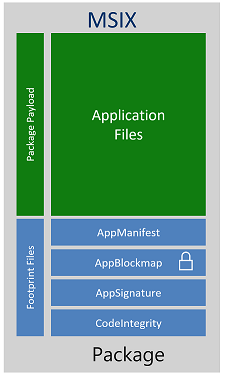

# What is MSIX?

MSIX is a Windows app package format that provides a modern packaging experience to all Windows apps. The MSIX package format preserves the functionality of existing app packages and/or install files in addition to enabling new, modern packaging and deployment features to Win32, WPF, and Windows Forms apps.

MSIX enables enterprises to stay current and ensure their applications are always up to date. It allows IT Pros and developers to deliver a user centric solution while still reducing the cost of ownership of application by reducing the need to repackage.

## Key features

* **Reliability.** MSIX provides a reliable install boasting a 99.96% success rate over millions of installs with a guaranteed uninstall.
* **Network bandwidth optimization.** MSIX decreases the impact to network bandwidth through downloading only the 64k block. This is done by leveraging the AppxBlockMap.xml file contained in the MSIX app package (see below for more details). MSIX is designed for modern systems and the cloud.
* **Disk space optimizations.** With MSIX there is no duplication of files across apps and Windows manages the shared files across apps. The apps are still independent of each other so updates will not impact other apps that share the file. A clean uninstall is guaranteed even if the platform manages shared files across apps.

## Highlights

* **Package existing Windows apps.** Use the [MSIX Packaging Tool](./packaging-tool/tool-overview.md) to create an MSIX package for any Windows app, old or new. The MSIX packaging tool streamlines the packaging experience, offering an interactive user interface or command line to convert and package Windows apps.
* **Install MSIX app packages.** Use [App Installer](app-installer/app-installer-root.md) to install or update any MSIX app package that is locally available or on any content distribution network.
* **Apply run time fixes to packaged apps.** The [Package Support Framework](psf/package-support-framework-overview.md) is an open source kit that helps you apply fixes to your existing desktop app when you don't have access to the source code, so that it can run in an MSIX container.
* **Use MSIX anywhere.** With the open source [MSIX SDK](msix-sdk/sdk-overview.md), MSIX packages are more versatile, and platform independent. The SDK provides all of the APIs needed to verify, validate, and unpack an app package on any platform, including Windows 10 and non-Windows 10 platforms.

## Introduction video to MSIX and resources

This video introduces the key ways that MSIX packaging can help you streamline and improve your app installation and deployment workflows.

 

> [!VIDEO https://www.youtube.com/embed/phrD081sMWc]

Visit the [MSIX Tech Community](https://aka.ms/msixcommunity) page for discussions and the latest information about MSIX. For additional resources about learning MSIX, see [this article](resources.md).

## Inside an MSIX package

### App payload

The payload files are the app code files and assets that are created when building the app.

### AppxBlockMap.xml

The package block map file is an XML document that contains a list of the app’s files along with indexes and cryptographic hashes for each block of data that is stored in the package. The block map file itself is verified and secured with a digital signature when the package is signed. The block map file allows MSIX packages to be downloaded and validated incrementally, and also works to support differential updates to the app files after they’re installed.

### AppxManifest.xml

The package manifest is an XML document that contains the info the system needs to deploy, display, and update an MSIX app. This info includes package identity, package dependencies, required capabilities, visual elements, and extensibility points.

### AppxSignature.p7x

The AppxSignature.p7x is generated when the package is signed. All MSIX packages are required to be signed before install. With the AppxBlockmap.xml, the platform is able to install the package and be validated.

## Supported platforms

For a full list of platforms that support MSIX see [MSIX features and supported platforms](supported-platforms.md).

## Validation, testing, and troubleshooting

For information about testing your MSIX implementation before deployment, see [MSIX Validation, Testing, and Troubleshooting](desktop/validation-overview.md).

## Benefits of app containers

Apps that are packaged using MSIX can be configured to run in a lightweight app container. The app's process, and its child processes, run inside the container, and are isolated using file system and registry virtualization. For more info, see [MSIX AppContainer apps](/windows/msix/msix-container).

All AppContainer apps can read the global registry. An AppContainer app writes to its own virtual registry and application data folder, and that data is deleted when the app is uninstalled or reset. Other apps don't have access to the virtual registry or virtual file system of an AppContainer app.
