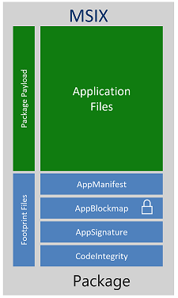

# What is MSIX?

MSIX is the modern Windows app packaging format. It gives any Windows app a reliable, clean install and uninstall, automatic updates, and access to Windows platform features that require a package identity.

**Package identity** is the key concept. When your app is packaged as MSIX, Windows assigns it a unique identity (publisher + name + version). That identity is required for:

- Windows platform APIs such as push notifications, background tasks, and live tiles
- AI features that use on-device models through the Windows AI APIs
- Store distribution and update channels
- Enterprise management through Intune and Configuration Manager

If you're not sure whether to package your app or which packaging model to use, start with the [Packaging decision guide](/windows/apps/package-and-deploy/).

## Key features

* **Reliable install and uninstall.** MSIX delivers a 99.96% install success rate across millions of installs and guarantees a clean uninstall with no leftover files or registry entries.
* **Differential updates.** Only changed 64 KB blocks are downloaded on update, minimizing network impact and update time.
* **Disk space efficiency.** Shared files across apps are managed by Windows; each app remains independent so updates don't affect other apps.
* **Containerized execution.** Apps run in a lightweight container with virtual file system and registry, and Windows virtualizes or redirects certain file system and registry writes to reduce system impact. See [MSIX containerization overview](msix-containerization-overview.md).
* **Enterprise-ready.** Full support for deployment via Intune, Configuration Manager, and the [Enterprise Modern App Management CSP](/windows/client-management/mdm/enterprisemodernappmanagement-csp).

## Get started

| Goal | Start here |
|---|---|
| Package a new UWP app | [Create an MSIX package from Visual Studio](package/packaging-uwp-apps.md) |
| Convert an existing installer to MSIX | [MSIX Packaging Tool](packaging-tool/tool-overview.md) |
| Package and sign from the command line | [WinApp CLI](/windows/apps/dev-tools/winapp-cli) |
| Deliver updates without the Store | [App Installer](app-installer/app-installer-root.md) |
| Decide between packaged and unpackaged | [Packaging decision guide](/windows/apps/package-and-deploy/) |
| Deploy to enterprise devices | [Enterprise deployment overview](desktop/managing-your-msix-deployment-overview.md) |

## Highlights

* **WinApp CLI.** The [WinApp CLI](/windows/apps/dev-tools/winapp-cli) provides command-line tools for the complete MSIX workflow: generating certificates, building packages, and signing without leaving the terminal.
* **Package existing Windows apps.** Use the [MSIX Packaging Tool](./packaging-tool/tool-overview.md) to create an MSIX package for any Windows app without access to source code.
* **Apply runtime fixes.** The [Package Support Framework](psf/package-support-framework-overview.md) lets you apply compatibility fixes to packaged apps without modifying the source code.
* **Cross-platform SDK.** The open source [MSIX SDK](msix-sdk/sdk-overview.md) provides APIs to verify, validate, and unpack MSIX packages on any platform.

## Inside an MSIX package

### App payload

The payload files are the app code files and assets built from your source.

### AppxBlockMap.xml

An XML document listing every file in the package with cryptographic hashes for each 64 KB block. Used for incremental download, differential updates, and integrity verification.

### AppxManifest.xml

The package manifest declares the app's identity, dependencies, capabilities, visual elements, and extension points. This is what Windows reads to deploy, display, and update the app.

### AppxSignature.p7x

Generated when the package is signed. All MSIX packages must be signed before installation. Combined with AppxBlockMap.xml, this enables Windows to verify package integrity at install time and at runtime.

## Supported platforms

For a full list of supported platforms, see [MSIX features and supported platforms](supported-platforms.md).

## Validation, testing, and troubleshooting

For testing and common errors, see the [MSIX troubleshooting guide](msix-troubleshooting-guide.md) and [MSIX validation and testing overview](desktop/validation-overview.md).

## Benefits of app containers

Apps packaged with MSIX can be configured to run in a lightweight app container that isolates the process using file system and registry virtualization. For a full explanation of what the container changes and how to work with it, see [MSIX containerization overview](msix-containerization-overview.md).
