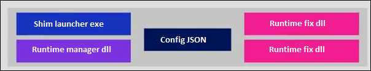
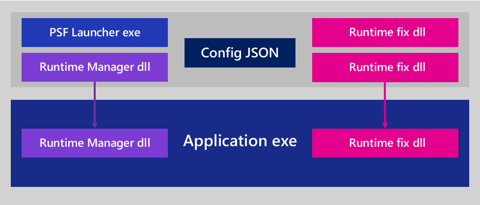

# Package Support Framework

The Package Support Framework is an open source kit that helps you apply fixes to your existing win32 application when you don't have access to the source code, so that it can run in an MSIX container. The Package Support Framework helps your application follow the best practices of the modern runtime environment.

To create the Package Support Framework, we leveraged the [Detours](https://www.microsoft.com/en-us/research/project/detours) technology which is an open source framework developed by Microsoft Research (MSR) and helps with API redirection and hooking.

This framework is open source, lightweight, and you can use it to address application issues quickly. It also gives you the opportunity to consult with the community around the globe, and to build on top of the investments of others.

For a step-by-step guide, see [Apply runtime fixes to an MSIX package by using the Package Support Framework](https://docs.microsoft.com/windows/uwp/porting/package-support-framework).

## A quick look inside of the Package Support Framework

The Package Support Framework contains an executable, a runtime manager  DLL, and a set of runtime fixes.

Here's how it works. You'll create a configuration file that specifies the fixes that you want to apply to your application. Then, you'll modify your package to point to the Package Support Framework (PSF) launcher executable file.

When users start your application, the Package Support Framework launcher is the first executable that runs. It reads your configuration file and injects the runtime fixes and the runtime manager DLL into the application process. The runtime manager applies the fix when it's needed by the application to run inside of an MSIX container.

## How to use the Package Support Framework

After you create a package for your application, install and run it, and observe its behavior. You might receive error messages that can help you identify a compatibility issue. You can also use [Process Monitor](https://docs.microsoft.com/sysinternals/downloads/procmon) to identify issues.

After you find an issue, you can check our [GitHub](https://github.com/Microsoft/MSIX-PackageSupportFramework/) page for a fix. If you find one, you can apply it to your package. Our [Step-by-step guide](https://docs.microsoft.com/windows/uwp/porting/package-support-framework) shows you how to do this. It will also show you how to use the Visual Studio debugger to step through your application and verify that the fix is working and that it has resolved the compatibility issue.

If you can't find a runtime fix that addresses your issue, you can create one. To do that, you'll identify which function calls fail when your application runs in an MSIX container. Then, you can create replacement functions that you'd like the runtime manager to call instead. This gives you an opportunity to replace the implementation of a function with behavior that conforms to the rules of the modern runtime environment.

## Get started with the Package Support Framework

If you're ready to begin using the Package Support Framework to resolve compatibility issues, see our step-by-step guide at [Apply runtime fixes to an MSIX package by using the Package Support Framework](https://docs.microsoft.com/windows/uwp/porting/package-support-framework).
