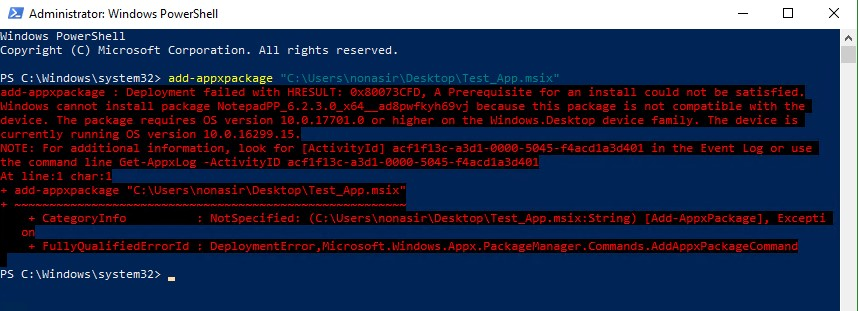
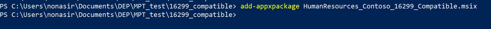

# MSIX Package support on 1709 and later

If you've converted an existing app to MSIX, you may want to use the app in earlier versions of Windows than 1809 (build 17701). This blog post discusses how to enable such apps in builds as early as 16299, also known as Windows 10 version 1709. 
 
 
## Problem:
So you converted your existing app to MSIX using the MSIX Packaging Tool and it runs fine on 1809 and later. But now that you know we are adding support for MSIX starting build 16299, you want to run your MSIX app on this or any later build. Currently, if you just try to install your MSIX app on a machine with build 16299 to 17700, you'll get this error message: 

## Solution:
We are working to update the MSIX Packaging Tool to handle this, but in the meantime here's what you can to do to set up your app to run on these builds:
 
Open the MSIX packaging tool and navigate to the package editor.

 

Navigate to your MSIX package. In my case, it is the Test_App.msix package. Click "open package"

On the bottom of the "Package Information" tab, observe the option to open the Manifest file. 

Select "Open file" and edit MinVersion to equal 16299 as shown below:

Once you are done editing the manifest, close the file. This will return you to the Package Editor.
Don't forget to re-sign the edited package as shown below:

Once the update has been made, save your changes.

At this point, you can install the app on a device with 16299 build or later.
 

 
## Troubleshooting tips:
For now, in devices running builds 16299 to 17700, you can install MSIX apps through PowerShell. 
Specifically, you need this command in PowerShell:
add-appxpackage <path to MSIX package>

You can also use Intune, SCCM or the Packaging Manager API.

