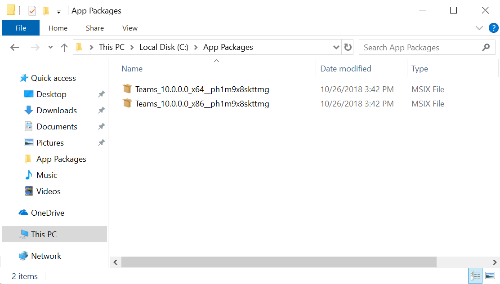

# Bundling MSIX Packages after converting using MSIX Packaging Tool 

In this article, we will go through the process of creating a bundle after converting x86 and x64 versions of your Windows installers. 

By bundling the multiple architecture versions of your installer into one entity, only the bundle needs to be uploaded to the Store or another distribution location. Windows 10 deployment platform is aware of the msixbundle package type and will only download the files that are applicable for your device's architecture. Keep in mind that if you decide to distribute a msixbundle for a particular app, you cannot revert back to distributing just a msix package. 

In the following section, I will go through a step-by-step approach to build an msixbundle assuming that you have already [converted your existing x86 and x64 versions](https://docs.microsoft.com/en-us/windows/msix/mpt-best-practices) of the Windows installer to MSIX packages. 

### Setup
You will need the following setup to successfully build an MSIX bundle:
- Windows 10 SDK(Version 1809 or above) - [Get it here](https://developer.microsoft.com/en-US/windows/downloads/windows-10-sdk)
- Converted x64 and x86 MSIX packages 

## Step 1: Find MakeAppx.exe
[MakeAppx.exe](https://docs.microsoft.com/en-us/windows/desktop/appxpkg/make-appx-package--makeappx-exe-) is a tool available in the Windows 10 SDK that allows for packaging and bundling of MSIX packages. We will use this tool to bundle the two msix packages together. 

MakeAppx can be used to extract the file contents of a Windows 10 app package or bundle and encrypts and decrypts app packages and bundles.

Once the Windows 10 SDK is installed, MakeAppx.exe is usually found here: 
- [x86] - C:\Program Files (x86)\Windows Kits\10\bin\10.0.17763.0\x86\MakeAppx.exe
- [x64] - C:\Program Files (x86)\Windows Kits\10\bin\10.0.17763.0\x64\MakeAppx.exe

## Step 2: Bundle the packages
Use MakeAppx.exe to bundle the packages like the following. The easiest way to bundle packages is by adding all the packages that you want to bundle together in one folder. The directory must be free of everything else except the packages that been to be bundled. 

Move the app packages that you want to bundle into one directory:



>[!NOTE] 
> MakeAppx.exe is only going to bundle packages that have the same identity, which means that the AppID, publisher, version needs to be the same. Only the package processor architecture for an application package can be different. 

```Command Prompt
C:\> "C:\Program Files (x86)\Windows Kits\10\bin\10.0.17763.0\x86\MakeAppx.exe" bundle /d input_directorypath /p filepath**.msixbundle**

Example:
C:\> "C:\Program Files (x86)\Windows Kits\10\bin\10.0.17763.0\x86\MakeAppx.exe" bundle /d c:\users\johnsmith\Desktop\AppPackages\ 
/p c:\users\johnsmith\Desktop\MyLOBApp_10.0.0.0_ph32m9x8skttmg.msixbundle
```

Packages do not need to be signed prior to bundling. You will need to sign them after to be able to distribute the app. After running the command, an unsigned msixbundle will be created in the path specified. 

## Step 3: Sign the bundle
Now that we created the bundle, you will need to sign the package before you can distribute the app to your users or even to install it. 

To sign a package, you will need a general code signing certificate and use the SignTool from the Windows 10 SDK. 

We strongly recommend that you use a trusted cert from certificate authority as that allows for the package to be distributed and deployed on your end users devices seamlessly. Once you have access to the private certificate(.pfx file), you can sign the package like so:

>[!NOTE]
> SignTool.exe can be found in the same directory as MakeAppx.exe and is distributed as part of the Windows 10 SDK. 

```Command Prompt
C:\> "C:\Program Files (x86)\Windows Kits\10\bin\10.0.17763.0\x86\SignTool.exe" sign /fd <Hash Algorithm> /a /f <Path to Certificate>.pfx /p <Your Password> <File path>.msixbundle

Example:
C:\> "C:\Program Files (x86)\Windows Kits\10\bin\10.0.17763.0\x86\SignTool.exe" sign /fd SHA256 /a /f c:\users\johnsmith\Desktop\private-cert.pfx /p aaabbb123 c:\users\johnsmith\Desktop\MyLOBApp_10.0.0.0_ph1m9x8skttmg_Signed.msixbundle
```

More information and help with signing app packages with SignTool is available [here](https://docs.microsoft.com/en-us/windows/uwp/packaging/sign-app-package-using-signtool). 

After successfully signing the bundle, you are ready to host it on a network share, or on any content distribution network to distribute it to your users. 

