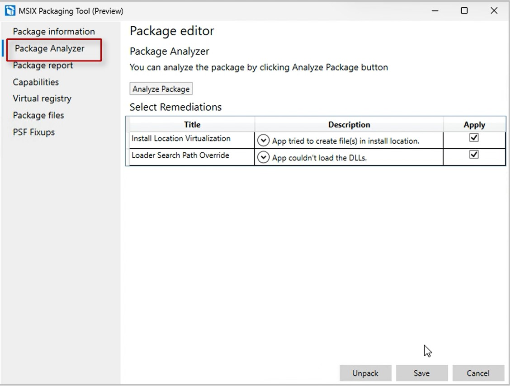

---
# Required metadata
# For more information, see https://review.learn.microsoft.com/help/platform/learn-editor-add-metadata?branch=main
# For valid values of ms.service, ms.prod, and ms.topic, see https://review.learn.microsoft.com/help/platform/metadata-taxonomies?branch=main

title:       Package Analyzer
description: feature in MSIX Packaging tool that analyzes the package. It then detects errors and suggests fixes.
author:      fiza-azmi # GitHub alias
ms.author:   fizaazmi # Microsoft alias
ms.topic:    article 
ms.date:     10/06/2023
---

# Analyze and resolve runtime issues

The **Package Analyzer** in [MSIX Packaging tool](/windows/msix/packaging-tool/tool-overview) provisions runtime analysis of an MSIX package and suggests remediations to fix post-conversion issues seamlessly. This feature simplifies conversion and packaging workflows, and saves time and effort by streamlining the debugging and application of fixes.

## Key features 

1: **Analyze Package:**
The analyze feature analyzes input MSIX package trace logs during runtime with one simple click

2: **Automated remediation:**
Based on the analysis, automated suggestions are provided by MSIX Packaging tool to fix the detected runtime errors. The fixes are then applied on saving the package.

## Package Analyzer

Once you have converted an app to MSIX format, to begin analysis:

1. Select **Package Editor** in the MSIX Packaging tool and Browse the MSIX package of your choice
2. Once you sign the package with a certificate, navigate to the **Package Analyzer** tab 
3. Click on **Analyze Package** button
4. The tool will automatically start examining the package for any issues. Play around with features of your application for a while to test functionality before stopping analysis
5. Once you click on **Stop Analysis**, the tool will suggest remediations to fix runtime issues with your application

6. Review the suggestions, unchecking fixes you don’t deem necessary, and click on **Save**
1. A new package will automatically be created with the selected fixes

## Supported fixes

Currently the following fixes are supported in Preview, and we are continuing to iterate on them further to cover more fixups and make your MSIX conversion processes more effortless.

1. RegLegacyFixups(PSF)
2. Installed location Virtualization
3. SearchPathoverride

