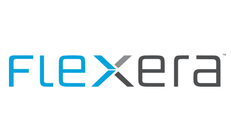

# MSIX partners

The following partners provide additional tooling and support for MSIX development scenarios.

:::row:::
    :::column:::
        
    :::column-end:::

    :::column:::
        
    :::column-end:::
    
    :::column:::
        
    :::column-end:::
:::row-end:::

:::row:::
    :::column:::
        
    :::column-end:::

    :::column:::
        
    :::column-end:::
    
    :::column:::
        
    :::column-end:::
:::row-end:::

:::row:::
    :::column:::
        
    :::column-end:::

    :::column:::
            
    :::column-end:::
    
    :::column:::
        
    :::column-end:::
:::row-end:::

:::row:::
    :::column:::
        
    :::column-end:::

    :::column:::
        
    :::column-end:::

    :::column:::
         
    :::column-end:::
:::row-end:::

<!--
:::row:::
    :::column:::
         
        [Learn more](http://info.accessitautomation.com/ty-evergreen-it-webinar-0)
    :::column-end:::

    :::column:::
         
        [Learn more](https://www.advancedinstaller.com/desktop-bridge)
    :::column-end:::
    
    :::column:::
         
        [Learn more)](https://www.appcure.io/)
    :::column-end:::
:::row-end:::

:::row:::
    :::column:::
         
        [Learn more](http://camwood.com/windows-10/)
    :::column-end:::

    :::column:::
         
        [Learn more)](https://cloudhouse.com/msixpr)
    :::column-end:::
    
    :::column:::
        [!FireGiant logo](images/FireGiant_Logo.png) 
        [Learn more](https://www.firegiant.com/r/msix/)
    :::column-end:::
:::row-end:::

:::row:::
    :::column:::
         
        [Learn more](https://www.flexera.com/company/news/press-releases/Flexera-Launches-Support-for-Microsofts-MSIX.html)
    :::column-end:::

    :::column:::
         
        [Learn more](https://www.installaware.com/msix.htm)
    :::column-end:::
    
    :::column:::
        [!Pace logo](images/Pace_Logo.png) 
        [Learn more](https://pacesuite.com/convert-exe-to-msix/)
    :::column-end:::
:::row-end:::

:::row:::
    :::column:::
         
        [Learn more](https://raynet.de/en/msix/)
    :::column-end:::

    :::column:::
         
        [Learn more](https://rimo3.com/msix)
    :::column-end:::
:::row-end:::
-->

<!--
:::row:::
    :::column:::
        
    :::column-end:::

    :::column:::
        
    :::column-end:::
    
    :::column:::
        
    :::column-end:::
:::row-end:::

:::row:::
    :::column:::
        
    :::column-end:::

    :::column:::
        
    :::column-end:::
    
    :::column:::
        
    :::column-end:::
:::row-end:::

:::row:::
    :::column:::
        
    :::column-end:::

    :::column:::
            
    :::column-end:::
    
    :::column:::
        
    :::column-end:::
:::row-end:::

:::row:::
    :::column:::
        
    :::column-end:::

    :::column:::
        
    :::column-end:::
    :::column:::
     	  
    :::column-end:::
:::row-end:::
-->

<!--
    :::column:::
       
    :::column-end:::
-->

<!--
    :::column:::
	
    :::column-end:::
-->
