# Create an application shortcut by running a script using Package Support Framework 

This document will show you how to create application shortcuts using Package Support Framework (PSF) that run scripts via the __MSIX Packaging Tool__ and the [Contoso Expense](https://github.com/microsoft/AppConsult-WinAppsModernizationWorkshop/tree/master/Exercise5/02-End) WPF application.

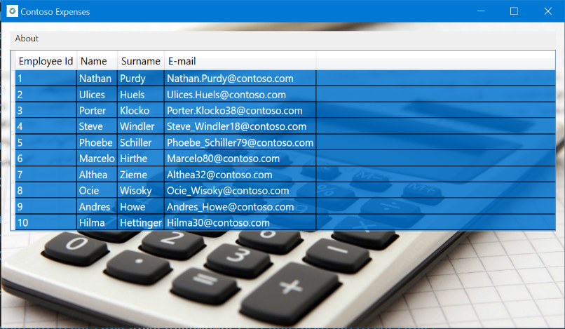

The idea is to copy the application shortcut, that will be available inside the package, to the user's Desktop through the PSF scripts.

There are a couple of things to keep in mind: 
1. Only create a shortcut if they are absolutely necessary. The goal is to not clutter the user's desktop. 
2. The MSIX application must be installed before creating the shortcut, so that we can specify the MSIX application path during the shortcut creation. 
3. At the same time, the MSIX application path can change, once it has the version number specified in the installation folder. Example of the __Contoso Expenses__ installation path:

C:\Program Files\WindowsApps\ContosoExpenses_`1.0.0.0`_x86__3z09h3y28h0qg

To avoid having to change the application shortcut every time the application is updated, create the shortcut by pointing to the [AppExecutionAlias](/windows/apps/desktop/modernize/desktop-to-uwp-extensions). The __AppExecutionAlias__ allows it to launch the application with the value defined in the alias session of the application manifest, so there is no need to specify the full application path. Therefore, before create the shortcut, define the alias in the application manifest. Otherwise, Windows Explorer will not recognize the alias and it will not allow us to create the shortcut.

## Create the application alias

Click on the __Package information__ menu item and click on __Open File__, available on the bottom of UI, to edit the application manifest:

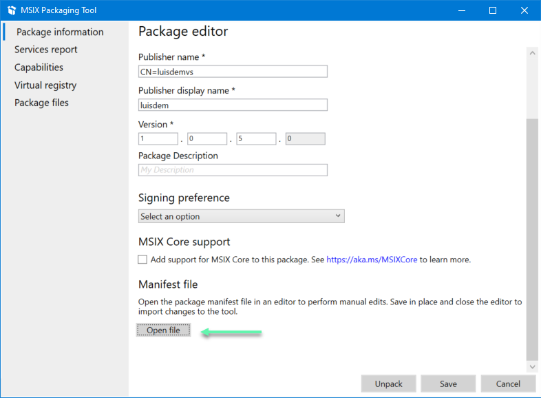

Include the following namespaces, that will be used to create the alias, as follows:

```xml
xmlns:uap3="http://schemas.microsoft.com/appx/manifest/uap/windows10/3" xmlns:desktop="http://schemas.microsoft.com/appx/manifest/desktop/windows10" 
```

Include the value __uap3__ and __desktop__ in the __IgnorableNamespaces__ element:

```xml
IgnorableNamespaces="uap uap3 desktop rescap build"
```

Include the application's execution alias after the __</uap:VisualElements>__ element:

```xml
  <Extensions>
    <uap3:Extension Category="windows.appExecutionAlias"   
                    Executable="ContosoExpenses\ContosoExpenses.exe"
                    EntryPoint="Windows.FullTrustApplication">
      <uap3:AppExecutionAlias>
        <desktop:ExecutionAlias Alias="contosoexpenses.exe" />
        </uap3:AppExecutionAlias>
      </uap3:Extension>
  </Extensions>
```

Follows the manifest with the modifications:

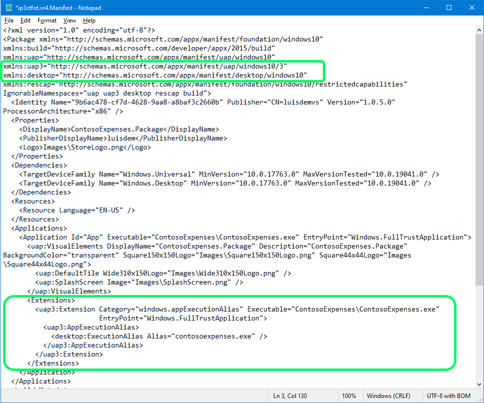

__Save__ and __close__ the manifest file.

Switch back to the MSIX Packaging Tool and __generate a new package__. Once the package is created, __install the package__ and start the application through the alias, for example, by pressing Win+R and typing __contosoexpenses__:

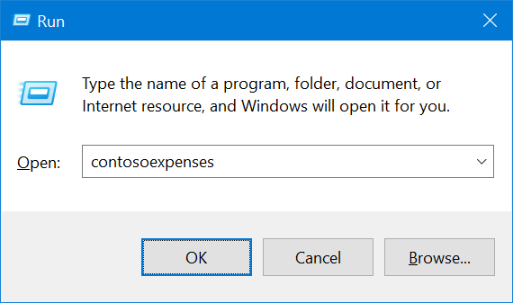

Now that the alias is created, it is possible to proceed to the next steps.

## Create the application shortcut

Create a new application shortcut in a folder of your preference using the alias __contosoexpenses.exe__, as follows:

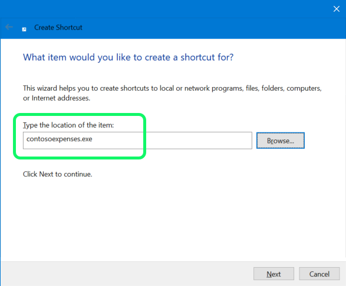

Name the shortcut for Contoso Expenses:

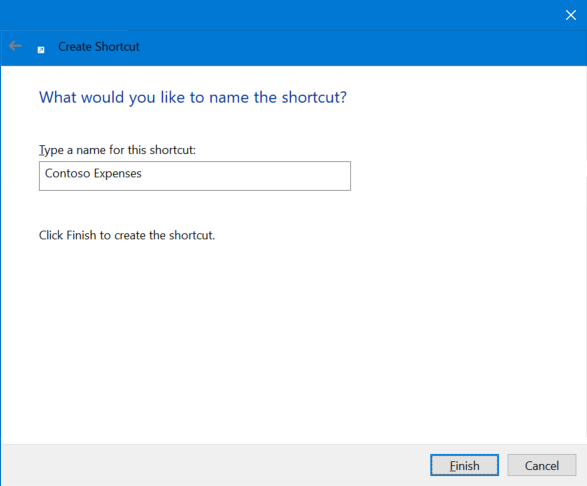

By default, the shortcut will be a generic icon:

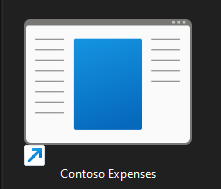

Changing the shortcut is straightforward but the challenge here is to avoid using the full application path that has the version number and that may change in a future update. One way to solve this, is to copy the icon from the package to the %appdata% used by the MSIX application, i.e., the __%localappdata%\Packages\ContosoExpenses_3z09h3y28h0qg\LocalCache\Roaming\___ folder that doesn't have version number.

To change the application shortcut, for now, it is needed to manually copy the icon to that folder. This will be automated later using PSF scripts.

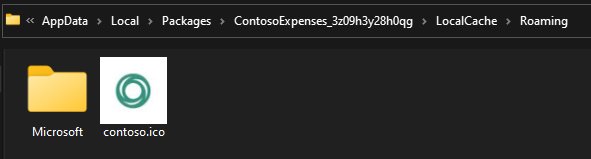

Now, it is possible to change the shortcut icon to the %localappdata% path:

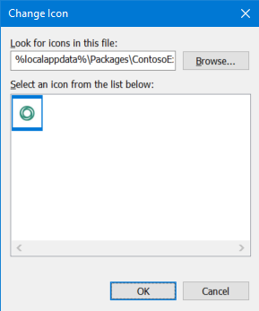

Still in the shortcut properties, take advantage and change the values of the __target__ and __start in__ properties para __%localappdata%\Microsoft\WindowsApps\contosoexpenses.exe__ e __%localappdata%\Microsoft\WindowsApps__ respectively:

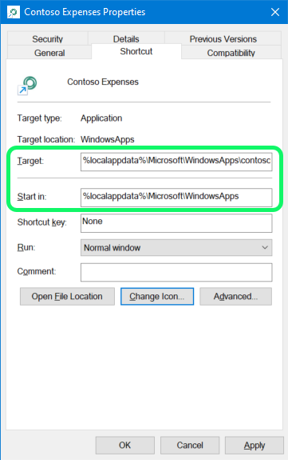

Now that the shortcut is working, the next step is to add it to the package and to automate the creation process.

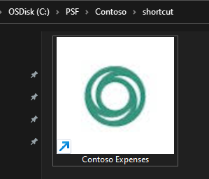


## Get the PSF files

Download the __PSFBinaries.zip__ from the [PSF Github repo](https://github.com/Microsoft/MSIX-PackageSupportFramework/releases).

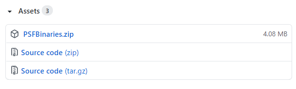

Extract the required 32-bit or 64-bit files to the root of your package directory, depending if your application is 32 or 64-bit. Use the following table as a guide.

| Application executable is x64 | Application executable is x86 |
|-------------------------------|-----------|
| [PSFLauncher64.exe](https://github.com/Microsoft/MSIX-PackageSupportFramework/tree/master/PsfLauncher/#readme) |  [PSFLauncher32.exe](https://github.com/Microsoft/MSIX-PackageSupportFramework/tree/master/PsfLauncher/#readme) |
| [PSFRuntime64.dll](https://github.com/Microsoft/MSIX-PackageSupportFramework/tree/master/PsfRuntime/readme.md) | [PSFRuntime32.dll](https://github.com/Microsoft/MSIX-PackageSupportFramework/tree/master/PsfRuntime/readme.md) |

## Include the PSF files in the package

Edit the __Contoso Expense__ through __MSIX Packaging Tool__ :

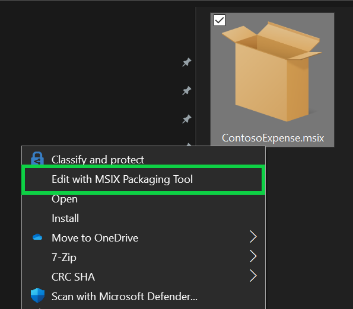

Click on the __Package Files__ menu item, click with the right button on the __Package__ folder and select __Add File...__:

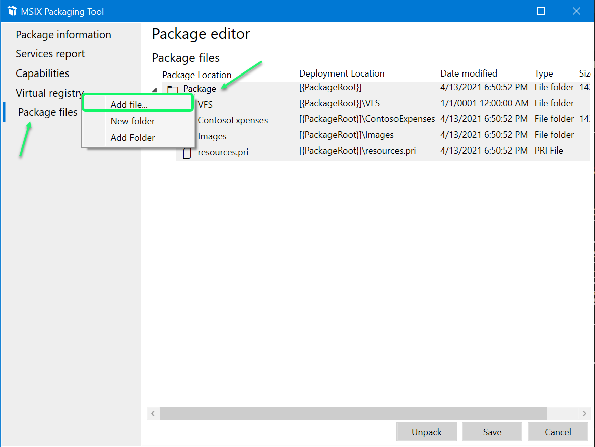

As the ContosoExpense build here is 32-bit, it was added the PSF 32-bit required files. Your package content should now look something like this:

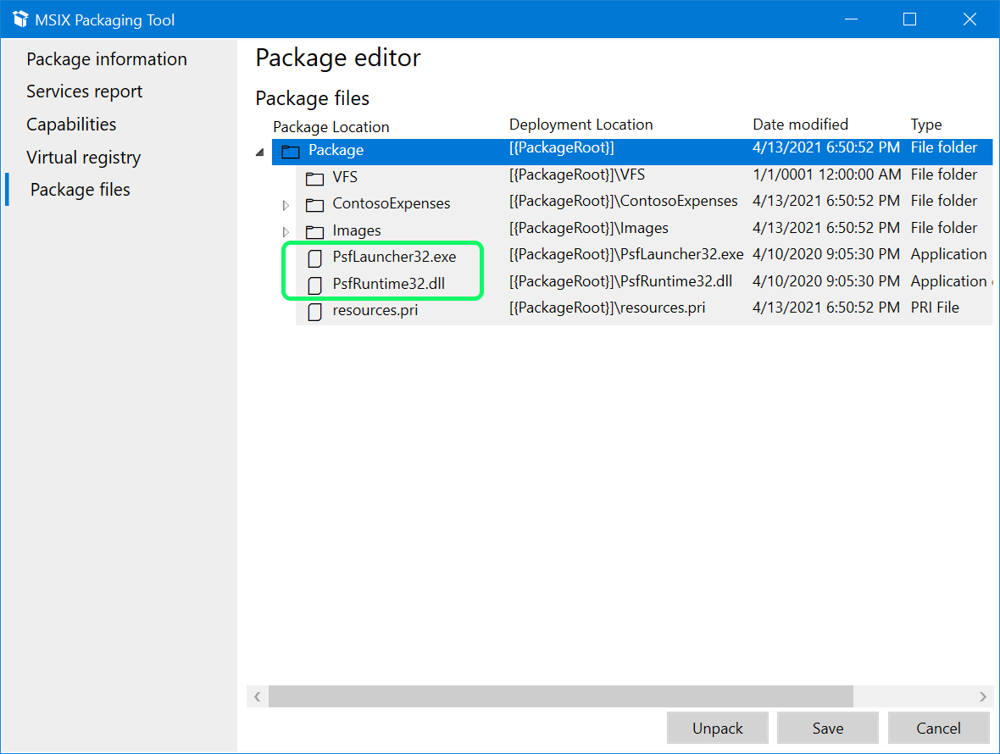

## Update the package manifest for PSF

Click on the __Package information__ menu item and click on __Open File__, available on the bottom of UI, to edit the application manifest:


In this step, it is necessary to change the application entry point (ContosoExpenses\ContosoExpenses.exe) by the PSFLauncher32.exe.

```xml
 <Application Id="App" Executable="PSFLauncher32.exe" EntryPoint="Windows.FullTrustApplication">
```

__Save__ and __close__ the manifest file.

### Create the config.json file

Switch back to the __MSIX Packaging Tool__, click on __Package files__, select the Package folder and add a new config.json file with the following content.

```json
{
  "applications": [
    {
      "id": "App",
      "executable": "ContosoExpenses/ContosoExpenses.exe",
      "workingDirectory": "ContosoExpenses/",
      "startScript":
      {
        "scriptPath": "createshortcut.ps1",
        "runInVirtualEnvironment": false,
        "waitForScriptToFinish": true,
        "showWindow": false,
        "runOnce": true
      }
    }
  ]
}
```

👀 Observe that the application id is the same from the manifest:

The __config.json__ file must be created in the package root, as follows:

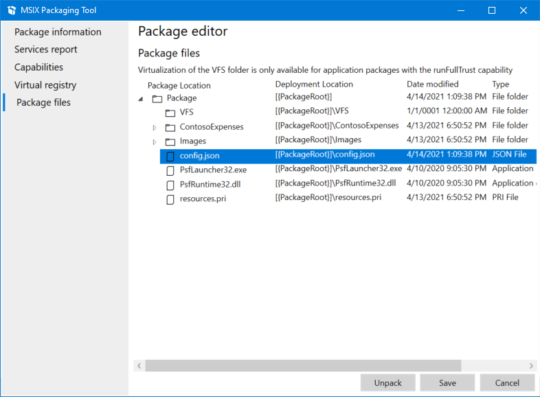

The __config.json__ file is being used to specify that the __createshortcut.ps1__ script should run only once in the first application initialization. As the __working directory__ is set to __ContosoExpenses__, the __createshortcut.ps1__ script (that will be created later) and the __StartingScriptWrapper.ps1__ script (from PSF files) must be added to the __ContosoExpenses__ folder.

## Create the PowerShell script

Create the createshortcut.ps1 script with the following content:

```powershell
Copy-Item "Contoso Expenses.lnk" "$env:USERPROFILE\desktop\Contoso Expenses.lnk"

Copy-Item "contoso.ico" $env:APPDATA\contoso.ico
```

The createshortcut.ps1 script will copy the __"Contoso Expenses.lnk"__ shortcut, created previously and that will be available inside the package, to the user desktop. The second instruction, copies the contoso.icon to the MSIX APPDATA folder (%localappdata%\Packages\ContosoExpenses_3z09h3y28h0qg\LocalCache\Roaming\).

The next step is to copy the following files to the ContosoExpenses folder of the package:

* __Contoso Expenses.lnk__
* __Contoso.ico__
* __StartingScriptWrapper.ps1__
* __createshortcut.ps1__

Finally, the last step is to __create__ and __install__ the new version of the application package. During the __first application initialization__, the __createshortcut.ps1__ script will run and it will create the __Contoso Expense shortcut__ in the user Desktop.
