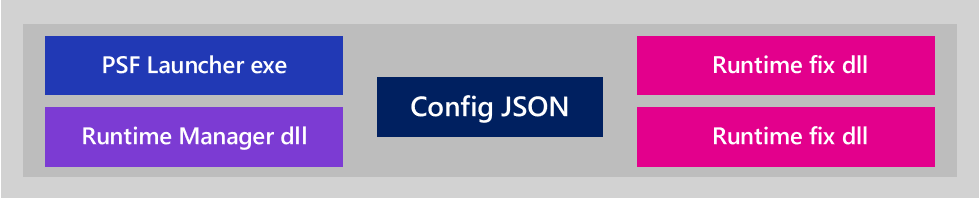
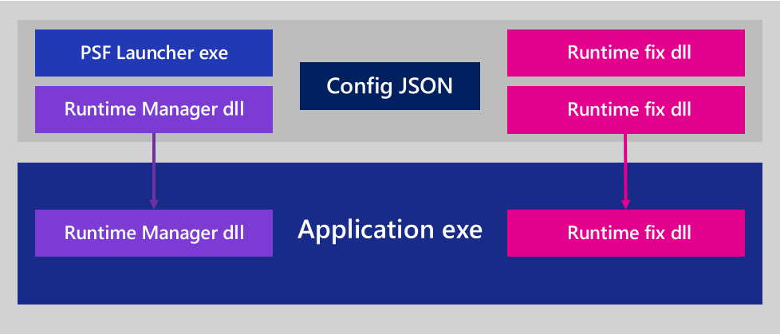

# Package Support Framework overview

The Package Support Framework (PSF) is an open-source kit that applies fixes to an existing desktop
application when you don't have access to its source code, so that the application can run in an
MSIX container. The PSF helps an application follow the practices of the modern runtime environment.

The PSF applies its fixes at runtime, in the processes you configure. Applying the PSF changes the
package itself: you add the PSF binaries, point the manifest at the PSF launcher, and repackage and
re-sign the package, as described in [Step 3: Apply a runtime fix](psf-apply-a-runtime-fix.md). At
runtime, the fixes intercept calls made by the processes listed in the configuration file in the
package. They don't change the files that the package installed, and they don't change how other
applications on the device behave.

The framework is lightweight, and you can use it to address application issues quickly. It's open
source, so you can also consult the community and build on the work of others.

## When to use the Package Support Framework

The PSF applies to a full-trust desktop application in an MSIX package. Here are common examples
where the PSF helps:

- The application can't find DLLs or data files when it's launched, because the process working
  directory defaults to the `System32` or `SysWOW64` directory rather than a location in the
  package. You can find the working directory the application expects in the shortcut that the
  original installer created. For the step-by-step fix, see
  [Package Support Framework - Working Directory fixup](psf-current-working-directory.md).
- The application writes to its install directory. This failure typically shows up as **ACCESS
  DENIED** results in [Process Monitor](/sysinternals/downloads/procmon) for paths under
  `%ProgramFiles%\WindowsApps`. For the step-by-step fix, see
  [How to fix Package Support Framework Filesystem Write Permission errors](psf-filesystem-writepermission.md).
- The application must be started with command-line arguments that a shortcut used to supply. For
  the step-by-step fix, see
  [Package Support Framework - Launching Windows apps with parameters](psf-launch-apps-with-parameters.md).
- The application depends on registry access, environment variables, or DLL load behavior that
  differs inside the container. See [Step 2: Find a runtime fix](psf-find-a-runtime-fix.md).

## What's inside the Package Support Framework

The PSF contains a launcher executable, a runtime manager DLL, and a set of runtime fixes.

| Component | Role |
|---|---|
| PSFLauncher32.exe, PSFLauncher64.exe | The executable that the package manifest starts in place of your application. It reads *config.json* and starts your application with the PSF runtime injected. |
| PSFRuntime32.dll, PSFRuntime64.dll | The runtime manager. It's injected into the application process, loads the fixups that *config.json* lists for that process, and injects itself into the child processes that the application starts. |
| PSFRunDll32.exe, PSFRunDll64.exe | An in-package replacement for the system *rundll32.exe*. Detours uses *rundll32.exe* to inject into a process of a different architecture, and a process whose executable is outside the package runs without package identity, so it can't load the PSF runtime DLL. Include these binaries when a cross-architecture launch is possible. |
| Fixup DLLs | The runtime fixes, such as *FileRedirectionFixup64.dll*. Each one replaces the implementation of the functions it targets. |
| config.json | The configuration file in the package root. It maps each application ID to an executable, and lists the fixes and settings for each process. |

Here's the process:

1. Create a configuration file that specifies the fixes you want to apply to your application.
1. Modify your package manifest to point to the PSF launcher executable.

When a user starts your application, the PSF launcher is the first executable that runs. It reads
your configuration file and injects the runtime manager DLL into the application process. The runtime
manager loads the runtime fixes that you configured for that process, and a fix takes effect when the
application makes a call that needs it to run inside an MSIX container.

The PSF uses [Detours](https://www.microsoft.com/research/project/detours), an open-source framework
developed by Microsoft Research for API redirection and hooking.

### Runtime fixes

The PSF includes the following runtime fixes:

- **FileRedirectionFixup**: redirects file reads and writes from locations the container doesn't
  allow the application to write to.
- **RegLegacyFixups**: remediates registry calls, including opening keys with more access than the
  container grants, deleting keys and values, and resolving values that live outside the package.
- **EnvVarFixup**: supplies environment variables that a traditional installer would have set on the
  system or the user.
- **DynamicLibraryFixup**: redirects DLL load calls to the copy of the DLL in the package.
- **ElectronFixup**: allows a basic Electron application to launch in an AppContainer. Its source is
  in the repository, but it isn't part of the PSF solution or the NuGet package, so you build it
  yourself.
- **TraceFixup**: a diagnostic tool rather than a fix. It reports the functions the application calls
  and whether those calls succeed. Its source is under *tests* in the repository, and its binaries
  are in the NuGet package.

To match a specific failure to a fix, see [Step 2: Find a runtime fix](psf-find-a-runtime-fix.md).
For the configuration schema of each fix, see the
[Package Support Framework repository](https://github.com/microsoft/MSIX-PackageSupportFramework).

## Package Support Framework releases

The source code is published in the
[microsoft/MSIX-PackageSupportFramework](https://github.com/microsoft/MSIX-PackageSupportFramework)
repository, and the pre-built binaries are published in the
[Microsoft.PackageSupportFramework](https://www.nuget.org/packages/Microsoft.PackageSupportFramework)
NuGet package. Recent release tags use the form `1.0.<yymmdd>.<revision>`. Recent releases publish
release notes but don't attach binaries to the release, so get the binaries from the NuGet package,
or build them from source. Check the version of the NuGet package you install so that you know which
release you're using.

The following table lists recent releases. For the complete list and full release notes, see
[Releases](https://github.com/microsoft/MSIX-PackageSupportFramework/releases).

| Release | Published | Highlights |
|---|---|---|
| [1.0.240212.1](https://github.com/microsoft/MSIX-PackageSupportFramework/releases/tag/1.0.240212.1) | February 2024 | Framework package support. RegLegacyFixups and EnvVarFixup can resolve a value in the context of a package dependency, so an application can retrieve information about its dependencies without global registry or environment variable access. |
| [1.0.231110.2](https://github.com/microsoft/MSIX-PackageSupportFramework/releases/tag/1.0.231110.2) | November 2023 | `DeletionMarker` remediation for RegLegacyFixups, which hides specific registry keys or values in the container. Error messages when *config.json* or *StartingScriptWrapper.ps1* is missing from the package. |
| [1.0.230224.1](https://github.com/microsoft/MSIX-PackageSupportFramework/releases/tag/1.0.230224.1) | February 2023 | `inPackageContext` setting, which runs the processes that an application starts in the same package context, including processes whose executables aren't in the package. Warnings when a start or end script fails, and a fix so that a `runOnce` script retries until it succeeds. |
| [1.0.221230.1](https://github.com/microsoft/MSIX-PackageSupportFramework/releases/tag/1.0.221230.1) | December 2022 | Argument redirection. When the application starts another application and passes a file path as an argument, the PSF rewrites the argument to the redirected per-user copy of that file when one exists. |
| [1.0.220926.1](https://github.com/microsoft/MSIX-PackageSupportFramework/releases/tag/1.0.220926.1) | September 2022 | EnvVarFixup, the `FakeDelete` remediation for RegLegacyFixups, and the `waitForDebugger` setting, which debug builds of the PSF launcher honor and release builds ignore, plus fixes to file redirection, DLL loading, and script handling. |

Each fixup and the PSF launcher ships with an XML metadata file that declares the version, the
minimum Windows version the fixup requires, a description, and when to use it. For an example, see
[FileRedirectionFixupMetadata.xml](https://github.com/microsoft/MSIX-PackageSupportFramework/blob/main/fixups/FileRedirectionFixup/FileRedirectionFixupMetadata.xml).
Check the metadata file of each fix you use, because the minimum Windows version differs between
fixes. For example, the ElectronFixup depends on the `CreateFileFromAppW` API and requires
Windows 10, version 1803 (10.0.17134) or later.

The PSF binaries are built for x86 and x64. On an Arm64 device, an x86 or x64 packaged application
runs under emulation and uses the x86 or x64 PSF binaries that match it. x64 emulation on Arm
requires Windows 11; Windows 10 on Arm supports x86 emulation only, so use the x86 PSF binaries
for emulated applications on Windows 10 on Arm.

To move a package to a newer PSF release, install the newer NuGet package version, replace the PSF
binaries in your package layout, then repackage, sign, and reinstall the package as described in
[Step 3: Apply a runtime fix](psf-apply-a-runtime-fix.md). Increment the package version when you
repackage, because Windows doesn't install a package over a package that has a higher version.

## Step-by-step guidance

Work through the following steps to apply the PSF to your package. For the prerequisites and an
overview of the whole workflow, see
[Get started with the Package Support Framework](package-support-framework.md).

| Step | What you do |
|---|---|
| [Step 1: Identify compatibility issues](psf-identify-issues.md) | Reproduce the failure and capture it with Process Monitor or the Trace Fixup. |
| [Step 2: Find a runtime fix](psf-find-a-runtime-fix.md) | Match the failure to a fix that ships with the PSF, a community fix, or a new fix you write. |
| [Step 3: Apply a runtime fix](psf-apply-a-runtime-fix.md) | Add the PSF binaries to the package, update the manifest, author *config.json*, and repackage. |
| [Step 4: Debug or extend a runtime fix](psf-debug-a-runtime-fix.md) | Debug the fix, extend it, or build a new one in Visual Studio. |

Related tasks:

- [Automated PSF config generation](psf-integration-with-mpt.md)
- [Apply the Package Support Framework in Visual Studio](package-support-framework-vs.md)
- [Run scripts with the Package Support Framework](run-scripts-with-package-support-framework.md)
- [Create a Package Support Framework fixup](create-package-support-framework.md)

## Limitations

- The PSF fixes runtime behavior. It doesn't change what the package installs, and it isn't a
  substitute for correcting the application itself.
- The PSF requires package identity. The runtime manager reads the package identity and the package
  root during initialization, so it works only in a process that runs with package identity, and it
  applies to full-trust packaged desktop applications, which declare
  `EntryPoint="Windows.FullTrustApplication"` and the `runFullTrust` restricted capability. If the
  runtime manager can't initialize, for example because *config.json* is missing from the package
  root, it fails to load, and the process usually fails to start.
- The runtime manager is injected into the process that the PSF launcher starts and into the child
  processes that process creates. Which fixes apply to each process is decided by matching the
  process name against the `processes` array in *config.json*, so a process that doesn't match any
  entry runs without fixes. A process that the PSF launcher didn't start, directly or indirectly,
  doesn't get the runtime manager at all. To run child processes whose executables aren't in the
  package in the package context, use the `inPackageContext` setting, added in release 1.0.230224.1.
- A fix can intercept only the functions that fixup implements. If the application uses an API that
  no fixup targets, you need to
  [create a fixup](create-package-support-framework.md) that targets it.
- Registry compatibility is handled at runtime by RegLegacyFixups, which modifies registry calls
  such as key access requests and deletions. The PSF doesn't author entries into the package's
  virtual registry, so use your packaging tool for registry state that must exist at install time.
- The PSF binaries in the NuGet package are x86 and x64 only.

## Data and telemetry

The Package Support Framework includes telemetry that collects usage data and sends it to Microsoft
to help improve our products and services. Read Microsoft's
[privacy statement to learn more](https://privacy.microsoft.com/privacystatement). Data is collected
only when both of the following conditions are met:

- The Package Support Framework binaries are used from the
  [NuGet package](https://www.nuget.org/packages/Microsoft.PackageSupportFramework) on a Windows
  device.
- The user has enabled collection of data on the device.

The NuGet package contains signed binaries and collects usage data from the device. Telemetry isn't
collected when the binaries are built locally by cloning the repository or downloading the binaries
directly.

## Related content

- [Get started with the Package Support Framework](package-support-framework.md)
- [Package Support Framework repository](https://github.com/microsoft/MSIX-PackageSupportFramework)
- [Create an MSIX package](../packaging-tool/create-an-msix-overview.md)
