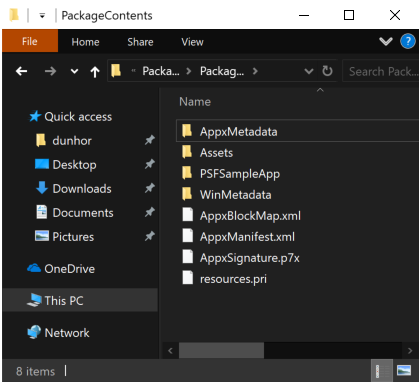
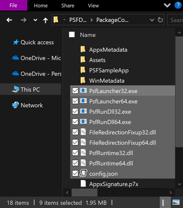

# Step 3: Apply a runtime fix to your MSIX package

This is the third step in the [Package Support Framework (PSF) workflow](package-support-framework.md).
After you choose a runtime fix in [Step 2](psf-find-a-runtime-fix.md), add the PSF to your MSIX
package and configure the fix.

You can apply an existing runtime fix with tools from the Windows SDK.

> [!div class="checklist"]
> * Create a package layout folder
> * Get the Package Support Framework files
> * Add the files to your package
> * Modify the package manifest
> * Create a configuration file
> * Package, sign, and test

> [!TIP]
> If you package with the [MSIX Packaging Tool](../packaging-tool/tool-overview.md), it can detect
> common issues and generate the PSF configuration for you. See
> [Automated PSF config generation](psf-integration-with-mpt.md). If you build your package from a
> Visual Studio solution, see
> [Apply the Package Support Framework in Visual Studio](package-support-framework-vs.md).

## Create the package layout folder

If you already have an MSIX package, unpack its contents into a layout folder that serves as the
staging area for the updated package. Use the MakeAppx tool from the Windows SDK, from the folder
that matches the architecture of the device you're working on. Depending on the installation path of
the SDK, you find *makeappx.exe* here:

- x86: `C:\Program Files (x86)\Windows Kits\10\bin\<SDK version>\x86\makeappx.exe`
- x64: `C:\Program Files (x86)\Windows Kits\10\bin\<SDK version>\x64\makeappx.exe`
- Arm64: `C:\Program Files (x86)\Windows Kits\10\bin\<SDK version>\arm64\makeappx.exe`

```powershell
makeappx unpack /p PSFSamplePackage_1.0.60.0_AnyCPU_Debug.msix /d PackageContents
```

The layout folder looks something like this.



If you don't have a package to start from, create the package folder and files from scratch.

## Get the Package Support Framework files

The PSF binaries ship in the **Microsoft.PackageSupportFramework** NuGet package. Recent releases in
the [Package Support Framework repository](https://github.com/microsoft/MSIX-PackageSupportFramework/releases)
publish release notes but don't attach binaries, so get the binaries from NuGet, or build them from
source. Use either the NuGet command-line tool or Visual Studio.

### Get the package by using the command-line tool

Install the NuGet command-line tool from [nuget.org/downloads](https://www.nuget.org/downloads).
Then run this command:

```powershell
nuget install Microsoft.PackageSupportFramework
```

Alternatively, rename the *.nupkg* extension to *.zip* and extract it. The binaries you need are
under the */bin* folder.

### Get the package by using Visual Studio

In Visual Studio, right-click the solution or project node and select one of the **Manage NuGet
Packages** commands. Search for **Microsoft.PackageSupportFramework** or **PSF** to find the package
on nuget.org, and then install it.

To confirm which version you're adding and what changed in it, see
[Package Support Framework releases](package-support-framework-overview.md#package-support-framework-releases).

## Add the Package Support Framework files to your package

Copy the PSF binaries into the root of the package layout folder, along with the DLL for each runtime
fix you selected in Step 2. In the following example, the package needs the file redirection fix.

| Application executable is x64 | Application executable is x86 |
|-------------------------------|-----------|
| [PSFLauncher64.exe](https://github.com/microsoft/MSIX-PackageSupportFramework/blob/main/PsfLauncher/Readme.md) |  [PSFLauncher32.exe](https://github.com/microsoft/MSIX-PackageSupportFramework/blob/main/PsfLauncher/Readme.md) |
| [PSFRuntime64.dll](https://github.com/microsoft/MSIX-PackageSupportFramework/blob/main/PsfRuntime/readme.md) | [PSFRuntime32.dll](https://github.com/microsoft/MSIX-PackageSupportFramework/blob/main/PsfRuntime/readme.md) |
| [PSFRunDll64.exe](https://github.com/microsoft/MSIX-PackageSupportFramework/blob/main/PsfRunDll/readme.md) | [PSFRunDll32.exe](https://github.com/microsoft/MSIX-PackageSupportFramework/blob/main/PsfRunDll/readme.md) |

*PSFRuntime32.dll* and *PSFRuntime64.dll* must keep those names and must be in the package root.
*PSFRunDll32.exe* and *PSFRunDll64.exe* are required only when a cross-architecture launch is
possible, as described in [Modify the package manifest](#modify-the-package-manifest). For the
placement and naming rules that the PSF expects, see
[Package layout](https://github.com/microsoft/MSIX-PackageSupportFramework/blob/main/layout.md).

Also copy the fixup DLL for each architecture that the fix is injected into. The fixups that ship
with the PSF are built for both architectures and named with a `32` or `64` suffix, for example
*FileRedirectionFixup32.dll* and *FileRedirectionFixup64.dll*. When the PSF runtime loads a fixup, it
first tries the file name exactly as it appears in *config.json*. If that file isn't found, it
appends the bitness of the current process to the name and tries again. A single entry of
`"dll": "FileRedirectionFixup.dll"` therefore loads *FileRedirectionFixup32.dll* in a 32-bit process
and *FileRedirectionFixup64.dll* in a 64-bit process, so one configuration entry can cover a package
that contains both. For more information, see
[Fixup loading](https://github.com/microsoft/MSIX-PackageSupportFramework/blob/main/PsfRuntime/readme.md#fixup-loading).

Your package content should now look something like this.



## Modify the package manifest

Open the package manifest, *AppxManifest.xml*, in a text editor, and set the `Executable` attribute
of the `Application` element to the PSF launcher executable. Leave the `Id` attribute unchanged: the
launcher uses it to find the matching entry in *config.json*, and changing it breaks existing
shortcuts, execution aliases, and other activation points that reference the application.

```xml
<Package ...>
  ...
  <Applications>
    <Application Id="PSFSample"
                 Executable="PSFLauncher32.exe"
                 EntryPoint="Windows.FullTrustApplication">
      ...
    </Application>
  </Applications>
</Package>
```

Match the launcher to the architecture of your application executable: *PSFLauncher64.exe* for a
64-bit executable, *PSFLauncher32.exe* for a 32-bit executable. A cross-architecture launch, such as
*PSFLauncher32.exe* starting a 64-bit application, is supported, but it does extra work on every
launch and it has an extra requirement. Detours does the injection through a helper process that
matches the architecture of the target process, and the PSF provides *PSFRunDll32.exe* and
*PSFRunDll64.exe* as in-package replacements for the system *rundll32.exe*, which would break away
from the package, run without package identity, and fail to load the PSF runtime DLL. If a
cross-architecture launch is possible in your package, include both the 32-bit and the 64-bit
*PSFRuntime* and *PSFRunDll* binaries.

Keep `EntryPoint="Windows.FullTrustApplication"`. The PSF applies to full-trust packaged desktop
applications, not to UWP applications.

> [!NOTE]
> The PSF binaries are built for x86 and x64 only. On an Arm64 device, an x86 or x64 packaged
> application runs under emulation and uses the x86 or x64 PSF binaries that match it.

> [!NOTE]
> Repeat this change for every `Application` element that needs a runtime fix. A package can declare
> more than one application, and each one has its own entry in *config.json*.

## Create a configuration file

Create a file named *config.json*, and save it to the root folder of your package. Set the
application `id` to the value of the `Id` attribute in the package manifest, and set `executable` to
the application executable you replaced with the launcher.

Using what you learned from Process Monitor in [Step 1](psf-identify-issues.md), you can also set
the working directory and use the file redirection fix to redirect reads and writes of *.log* files
under the package-relative *PSFSampleApp* directory.

```json
{
    "applications": [
        {
            "id": "PSFSample",
            "executable": "PSFSampleApp/PSFSample.exe",
            "workingDirectory": "PSFSampleApp/"
        }
    ],
    "processes": [
        {
            "executable": "PSFSample",
            "fixups": [
                {
                    "dll": "FileRedirectionFixup.dll",
                    "config": {
                        "redirectedPaths": {
                            "packageRelative": [
                                {
                                    "base": "PSFSampleApp/",
                                    "patterns": [
                                        ".*\\.log"
                                    ]
                                }
                            ]
                        }
                    }
                }
            ]
        }
    ]
}
```

The following table describes the *config.json* schema.

| Array | Key | Value |
|-------|-----------|-------|
| applications | id |  Use the value of the `Id` attribute of the `Application` element in the package manifest. |
| applications | executable | The package-relative path to the executable that you want to start. In most cases, you can get this value from your package manifest file before you modify it. It's the value of the `Executable` attribute of the `Application` element. |
| applications | workingDirectory | (Optional) The working directory of the application that starts. A relative path is resolved against the package root, and a full path, such as one that begins with a drive letter, is used as it is. If you omit this value or set it to an empty string, the launcher uses the package root. Without the launcher, a packaged desktop application starts with the `System32` directory as its working directory, which is the cause of several common failures. |
| processes | executable | In most cases, this is the name of the `executable` configured above, with the path and file extension removed. The value is an ECMAScript regular expression that's matched against the name of each process the runtime is injected into, so one entry can cover more than one process. |
| fixups | dll | The name of the fixup DLL to load, relative to the package root. If the file isn't found, the PSF runtime appends the bitness of the current process to the name and tries again, so `FileRedirectionFixup.dll` loads *FileRedirectionFixup64.dll* in a 64-bit process. |
| fixups | config | (Optional) Controls how the fixup DLL behaves. The exact format of this value varies on a fixup-by-fixup basis, because each fixup interprets this "blob" as it wants. |

The `applications`, `processes`, and `fixups` keys are arrays. You can use *config.json* to specify
more than one application, process, and fixup DLL. For the full set of launcher settings, including
arguments, scripts, and monitor processes, see the
[PSF launcher readme](https://github.com/microsoft/MSIX-PackageSupportFramework/blob/main/PsfLauncher/Readme.md).

> [!IMPORTANT]
> *config.json* must be named *config.json* and must be in the package root. If the PSF runtime can't
> read its configuration, it fails to load, and the application usually fails to start. Recent PSF
> releases display an error when *config.json* is missing, and when a start or end script is
> configured but *StartingScriptWrapper.ps1* isn't in the package. For more information about
> scripts, see
> [Run scripts with the Package Support Framework](run-scripts-with-package-support-framework.md).

## Package and test the application

Create the package.

```powershell
makeappx pack /d PackageContents /p PSFSamplePackageFixup.msix
```

> [!NOTE]
> If the application ships in an MSIX bundle, unpack the bundle with `makeappx unbundle`, update each
> package it contains, and then rebuild the bundle with `makeappx bundle`.

Increment the `Version` attribute of the `Identity` element in the manifest before you pack, and
leave the `Name` and `Publisher` attributes unchanged so that the result updates the installed
package instead of installing next to it.

Repacking invalidates the signature of the original package, so sign the new package again.

```powershell
signtool sign /a /v /fd sha256 /f ExportedSigningCertificate.pfx PSFSamplePackageFixup.msix
```

The certificate you sign with must be trusted on the test device, and the `Publisher` value in the
manifest must match the certificate subject exactly. For more information, see
[Create a certificate for package signing](../package/create-certificate-package-signing.md) and
[Sign an app package using SignTool](../package/sign-app-package-using-signtool.md).

Install the package with PowerShell.

> [!NOTE]
> Windows doesn't downgrade an installed package: installation fails if the version of the package
> you're installing is lower than the version that's already installed. If you rebuild the package
> without incrementing the version, uninstall the installed package first with
> [Remove-AppxPackage](/powershell/module/appx/remove-appxpackage).

```powershell
Add-AppxPackage .\PSFSamplePackageFixup.msix
```

[Add-AppxPackage](/powershell/module/appx/add-appxpackage) installs the package for the user who runs
the command. To test the fix under a different account, install the package for that user as well, or
provision it for the device so that it installs for each user who signs in.

Run the application and observe its behavior with the runtime fix applied. Repeat the diagnostic and
packaging steps as needed.

## Check whether the Package Support Framework is running

To confirm that the launcher ran, open **Task Manager**, select **More details**, and find both the
PSF launcher process, *PSFLauncher32.exe* or *PSFLauncher64.exe*, and your application process on the
**Details** tab. The launcher starts your application and stays running as its parent process. To see
that parent and child relationship, use the process tree in
[Process Explorer](/sysinternals/downloads/process-explorer).

To confirm that the runtime manager was injected into the application process, select the application
process in Process Explorer, open the DLL view, and look for *PSFRuntime32.dll* or *PSFRuntime64.dll*
along with the fixup DLLs you configured. The PSF runtime is also injected into the child processes
that your application starts, so check those processes the same way when a failure happens in one of
them.

If the fix doesn't take effect, check the following:

- The `id` in *config.json* matches the `Id` attribute in the package manifest.
- The `executable` values point to files that exist in the package, relative to the package root.
- The `executable` value in the `processes` array matches the name of the process that fails, without
  a path or a file name extension.
- The package contains the fixup DLL for the architecture of the process it's injected into.
- The regular expressions in the configuration match the paths you captured in Step 1. Patterns are
  regular expressions, not wildcards, and JSON requires the backslash to be escaped. For example,
  `".*\\.log"` matches log files, while `"*.log"` doesn't.

## Next step

> [!div class="nextstepaction"]
> [Step 4: Debug or extend a runtime fix](psf-debug-a-runtime-fix.md)

## Related content

- [Get started with the Package Support Framework](package-support-framework.md)
- [Package Support Framework overview](package-support-framework-overview.md)
- [Package Support Framework - Working Directory fixup](psf-current-working-directory.md)
- [How to fix Package Support Framework Filesystem Write Permission errors](psf-filesystem-writepermission.md)
- [Run scripts with the Package Support Framework](run-scripts-with-package-support-framework.md)
