# Step 4: Debug or extend a runtime fix

This is the final step in the [Package Support Framework (PSF) workflow](package-support-framework.md).
Use it when the fix you applied in [Step 3](psf-apply-a-runtime-fix.md) doesn't fully resolve the
issue, when you want to extend an existing fix, or when you're building a new fix.

You need the following projects in a single Visual Studio solution.

> [!div class="checklist"]
> * A packaging project
> * A project for the runtime fix
> * A project that produces the PSF launcher executable
> * The application project, if you have the source code

When you're done, your solution looks something like this.

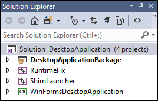

Each project in this example serves a distinct purpose.

| Project | Purpose |
|-------|-----------|
| DesktopApplicationPackage | Based on the [Windows Application Packaging project](../desktop/desktop-to-uwp-packaging-dot-net.md). It produces the MSIX package. |
| Runtimefix | A C++ dynamic-link library project that contains one or more replacement functions that serve as the runtime fix. |
| PSFLauncher | A C++ empty project. It collects the runtime distributable files of the Package Support Framework and produces the launcher executable, which is the first process that starts when you run the solution. |
| WinFormsDesktopApplication | Contains the source code of the desktop application. |

For a complete sample that contains all of these project types, see
[PSFSample](https://github.com/microsoft/MSIX-PackageSupportFramework/tree/main/samples/PSFSample).

## Create a package solution

If you don't already have a solution for your desktop application, create a **Blank Solution** in
Visual Studio.

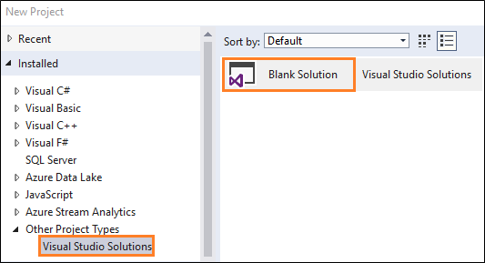

Add any application projects you have.

## Add a packaging project

If you don't already have a **Windows Application Packaging Project**, create one and add it to your
solution.

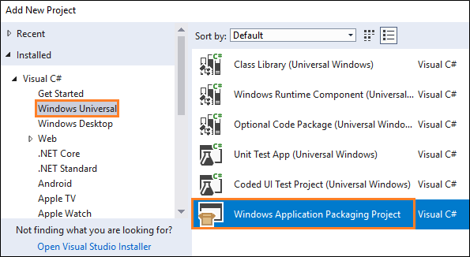

For more information, see
[Package your application by using Visual Studio](../desktop/desktop-to-uwp-packaging-dot-net.md).

In **Solution Explorer**, right-click the packaging project, select **Edit**, and then add this to
the bottom of the project file:

```xml
<Target Name="PSFRemoveSourceProject" AfterTargets="ExpandProjectReferences" BeforeTargets="_ConvertItems">
<ItemGroup>
  <FilteredNonWapProjProjectOutput Include="@(_FilteredNonWapProjProjectOutput)">
  <SourceProject Condition="'%(_FilteredNonWapProjProjectOutput.SourceProject)'=='<your runtime fix project name goes here>'" />
  </FilteredNonWapProjProjectOutput>
  <_FilteredNonWapProjProjectOutput Remove="@(_FilteredNonWapProjProjectOutput)" />
  <_FilteredNonWapProjProjectOutput Include="@(FilteredNonWapProjProjectOutput)" />
</ItemGroup>
</Target>
```

## Add a project for the runtime fix

Add a C++ **Dynamic-Link Library (DLL)** project to the solution.

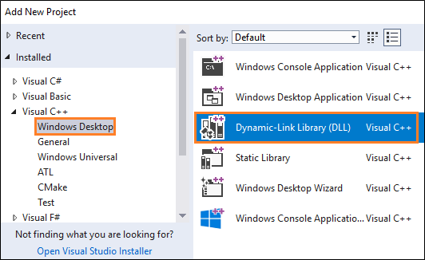

Right-click the project, and then select **Properties**.

In the property pages, find the **C++ Language Standard** field, and select the **ISO C++17 Standard
(/std:c++17)** option.

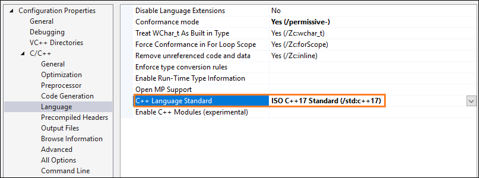

Right-click the project, and then select **Manage NuGet Packages**. Make sure that the **Package
source** option is set to **All** or **nuget.org**.

Search for the **PSF** NuGet package, and then install it for this project.

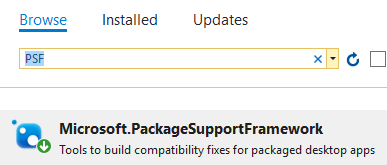

If you're debugging or extending an existing runtime fix, add the runtime fix files that you
identified in [Step 2: Find a runtime fix](psf-find-a-runtime-fix.md).

If you're creating a new fix, don't add anything to this project yet. For the code you add here, see
[Create a Package Support Framework fixup](create-package-support-framework.md).

## Add a project that starts the PSF launcher executable

Add a C++ **Empty Project** to the solution.

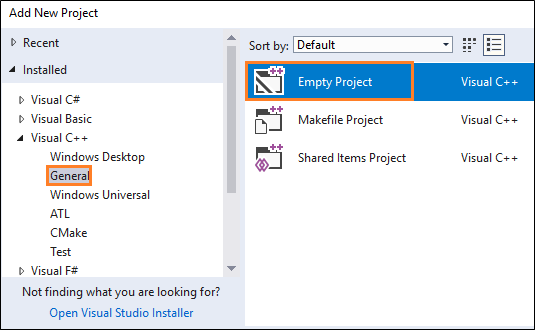

Add the **PSF** NuGet package to this project the same way you did in the previous section.

Open the property pages for the project, and on the **General** settings page, set the **Target
Name** property to `PSFLauncher32` or `PSFLauncher64`, depending on the architecture of your
application.

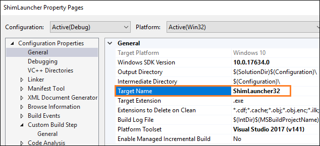

Add a project reference to the runtime fix project in your solution.

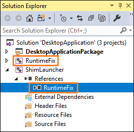

Right-click the reference, and then in the **Properties** window, apply these values.

| Property | Value |
|-------|-----------|
| Copy local | True |
| Copy Local Satellite Assemblies | True |
| Reference Assembly Output | True |
| Link Library Dependencies | False |
| Link Library Dependency Inputs | False |

## Configure the packaging project

In the packaging project, right-click the **Applications** folder, and then select **Add Reference**.

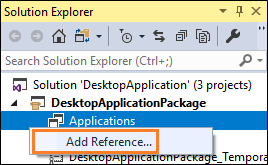

Select the PSF launcher project and your desktop application project, and then select **OK**.

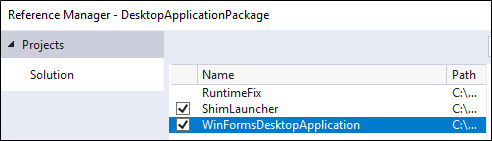

> [!NOTE]
> If you don't have the source code to your application, select only the PSF launcher project. You
> reference your executable in the configuration file instead.

In the **Applications** node, right-click the PSF launcher application, and then select **Set as
Entry Point**.

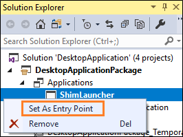

Add a file named *config.json* to your packaging project, copy the following JSON into it, and set
the **Package Action** property to **Content**.

```json
{
    "applications": [
        {
            "id": "",
            "executable": "",
            "workingDirectory": ""
        }
    ],
    "processes": [
        {
            "executable": "",
            "fixups": [
                {
                    "dll": "",
                    "config": {
                    }
                }
            ]
        }
    ]
}
```

Provide a value for each key. For the meaning of each key, see the
[*config.json* schema](psf-apply-a-runtime-fix.md#create-a-configuration-file) in Step 3.

When you're done, your *config.json* file looks something like this.

```json
{
  "applications": [
    {
      "id": "DesktopApplication",
      "executable": "DesktopApplication/WinFormsDesktopApplication.exe",
      "workingDirectory": "WinFormsDesktopApplication"
    }
  ],
  "processes": [
    {
      "executable": ".*App.*",
      "fixups": [ { "dll": "RuntimeFix.dll" } ]
    }
  ]
}
```

> [!NOTE]
> The `applications`, `processes`, and `fixups` keys are arrays, so a single *config.json* file can
> specify more than one application, process, and fixup DLL.

## Debug a runtime fix

In Visual Studio, press F5 to start the debugger. The PSF launcher starts first and, in turn, starts
your target desktop application. To debug the target application, attach to its process manually by
selecting **Debug** > **Attach to Process** and then selecting the application process. To debug a
.NET application together with a native runtime fix DLL, select both managed and native code types
(mixed-mode debugging).

After you attach, you can set breakpoints in the desktop application code and in the runtime fix
project. If you don't have the source code for your application, you can set breakpoints only in
your runtime fix project.

### Reproduce package path failures

F5 debugging runs the application by deploying loose files from the package layout folder rather
than installing from an MSIX package, so the layout folder usually doesn't carry the same security
restrictions as an installed package folder. As a result, you might not be able to reproduce package
path access denied errors before a runtime fix is applied.

To work around this, deploy an MSIX package instead of using F5 loose file deployment. Create the
package with the [MakeAppx](/windows/win32/appxpkg/make-appx-package--makeappx-exe-) tool from the
Windows SDK, as described in [Step 3](psf-apply-a-runtime-fix.md), or right-click your application
project node in Visual Studio and select **Publish** > **Create App Packages**.

### Debug the application startup path

Visual Studio has no built-in support for attaching to child processes launched by the debugger,
which makes it difficult to debug logic in the startup path of the target application.

To debug startup, use a debugger that supports attaching to child processes. It generally isn't
possible to attach a just-in-time (JIT) debugger to the target application, because most JIT
techniques launch the debugger in place of the target application through the
`ImageFileExecutionOptions` registry key. That defeats the detouring mechanism that the PSF launcher
uses to inject the runtime manager into the target application.

WinDbg, included in the [Debugging Tools for Windows](/windows-hardware/drivers/debugger/index) and
available in the [Windows SDK](https://developer.microsoft.com/windows/downloads/windows-10-sdk),
supports attaching to child processes. It also supports
[launching and debugging a packaged application](/windows-hardware/drivers/debugger/debugging-a-uwp-app-using-windbg)
directly.

To debug target application startup as a child process, start `WinDbg`. The `-plmPackage` value is
the package full name of the installed package, and the `-plmApp` value is the `Id` attribute of the
`Application` element in the package manifest. To get the package full name, run
`Get-AppxPackage <name> | Select-Object PackageFullName`.

```powershell
windbg.exe -plmPackage PSFSampleWithFixup_1.0.59.0_x86__7s220nvg1hg3m -plmApp PSFSample
```

At the `WinDbg` prompt, enable child debugging and set breakpoints. Child debugging is required
because the PSF launcher, not the debugger, starts the application process.

```console
.childdbg 1
g
```

Execution continues until the target application starts and breaks into the debugger.

```console
sxe ld FileRedirectionFixup64.dll
g
```

Execution continues until the fixup DLL is loaded. Use the file name of the fixup DLL that's in your
package, including the `32` or `64` suffix.

Now that the fixup DLL is loaded, set a breakpoint on one of its replacement functions and continue.
The debugger needs the symbol file (*.pdb*) that you built with the fixup to resolve the function
name.

```console
bp FileRedirectionFixup64!<function name>
g
```

> [!NOTE]
> [PLMDebug](/windows-hardware/drivers/debugger/plmdebug) can also attach a debugger to an
> application on launch, and is also included in the
> [Debugging Tools for Windows](/windows-hardware/drivers/debugger/index). It's more complex to use
> than the child process support that WinDbg provides.

## Support

Have questions? Ask on the
[Package Support Framework](https://techcommunity.microsoft.com/t5/Package-Support-Framework/bd-p/Package-Support)
conversation space on the MSIX Tech Community site, or open an issue in the
[Package Support Framework repository](https://github.com/microsoft/MSIX-PackageSupportFramework/issues).

## Related content

- [Get started with the Package Support Framework](package-support-framework.md)
- [Step 3: Apply a runtime fix to your MSIX package](psf-apply-a-runtime-fix.md)
- [Create a Package Support Framework fixup](create-package-support-framework.md)
- [Apply the Package Support Framework in Visual Studio](package-support-framework-vs.md)
- [Package Support Framework overview](package-support-framework-overview.md)
