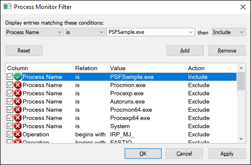
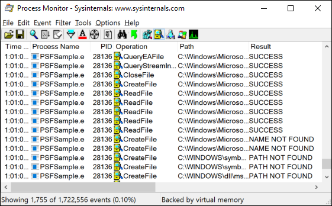
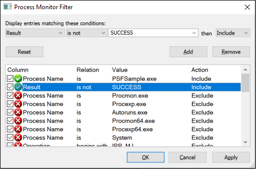
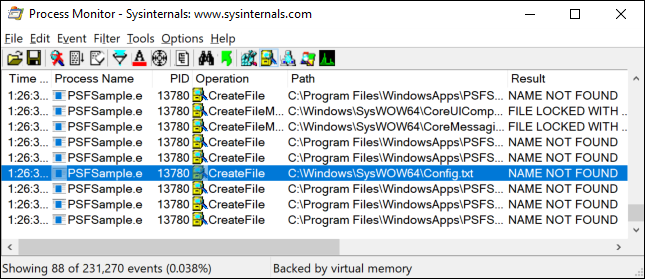
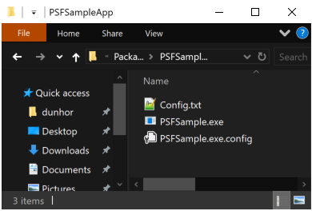
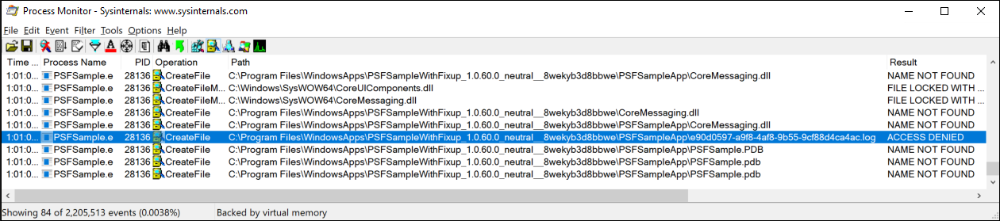
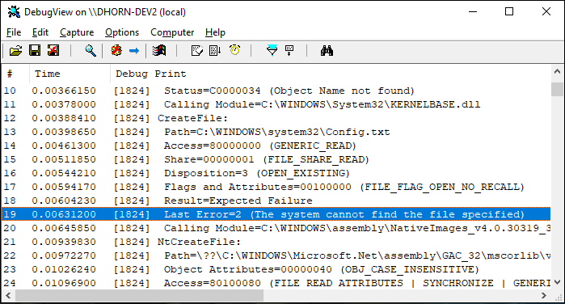
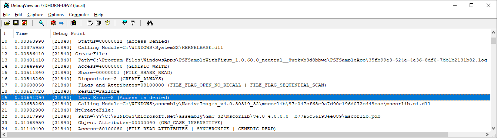

# Step 1: Identify compatibility issues in an MSIX container

This is the first step in the [Package Support Framework (PSF) workflow](package-support-framework.md).
Before you can choose a runtime fix, you need evidence of what the application actually does at
runtime and which call fails.

An MSIX package installs its files under `%ProgramFiles%\WindowsApps`, a location that grants the
application read and execute access but not write access. A packaged desktop application also starts
with `%windir%\System32` as its working directory, rather than the folder that holds the application
executable, unless the launch sets a different working directory. A 32-bit process sees the
`SysWOW64` directory instead, because of WOW64 file system redirection. Applications that were
designed for a traditional installer often depend on behavior that no longer holds in this
environment.

## Prerequisites

- Your desktop application packaged as an MSIX package, signed, and installed on the test machine.
  For more information, see [Create an MSIX package](../packaging-tool/create-an-msix-overview.md).
- [Process Monitor](/sysinternals/downloads/procmon) from Sysinternals.
- Optional: [DebugView](/sysinternals/downloads/debugview) from Sysinternals, if you plan to use the
  Trace Fixup.

## Reproduce the failure

Install the MSIX package, run the application, and record what you observe:

- The exact error text or dialog, and whether it appears at launch or during a specific task.
- The activation path that reproduces the failure, such as a Start menu shortcut, a taskbar shortcut,
  an execution alias, a file type association, or a protocol activation. A package can declare more
  than one application, and each one needs its own entry in *config.json* in
  [Step 3](psf-apply-a-runtime-fix.md).
- Whether the failure happens for every user or only for the user who installed the package.
- Whether the application recovers, hangs, or terminates.

Error messages alone rarely identify the failing call, so capture the behavior with Process Monitor
next.

## Use Process Monitor to identify an issue

[Process Monitor](/sysinternals/downloads/procmon) observes the file system, registry, and process
operations of a running application and reports the result of each operation. After you open Process
Monitor, add a filter (**Filter** > **Filter…**) that includes only events from your application's
process.



If your application starts other processes, add a filter for those process names too. The failure
often happens in a child process, such as a helper executable or an updater, rather than in the
process that the shortcut starts.

A list of events appears. For many of these events, the word **SUCCESS** appears in the **Result**
column.



Optionally, you can filter the events to show only failures.



If you suspect a file system access failure, look for failed events under either the
`System32`/`SysWOW64` directory or the package file path. Start at the bottom of the list and scroll
upward, because the failures at the bottom occurred most recently. Pay the most attention to results
such as **ACCESS DENIED**, **NAME NOT FOUND**, and **PATH NOT FOUND**.

The [PSFSample](https://github.com/microsoft/MSIX-PackageSupportFramework/tree/main/samples/PSFSample)
application has two issues, both visible in the following capture.



In the first issue, the application fails to read the *Config.txt* file from the
`C:\Windows\SysWOW64` path. The application is unlikely to reference that path directly. It's more
likely reading the file through a relative path, and `System32`/`SysWOW64` is the default working
directory of the process. That behavior indicates the application expects its working directory to
be set to a location in the package. Looking inside the package confirms that the file is installed
in the same directory as the executable.



The second issue appears in the following capture.



Here, the application fails to write a *.log* file to its package path, which points to a file
redirection fix.

> [!TIP]
> Two failures account for most Package Support Framework cases, and each has a focused
> walkthrough that starts with the Process Monitor capture:
>
> - [Package Support Framework - Working Directory fixup](psf-current-working-directory.md), when the
>   application can't find files it ships with.
> - [How to fix Package Support Framework Filesystem Write Permission errors](psf-filesystem-writepermission.md),
>   when the application writes to its install directory.

## Use the Trace Fixup

The Trace Fixup is an alternative diagnostic technique. Despite its name, it doesn't change runtime
behavior. It uses the same interception technology as the runtime fixes to report which function the
application called, which module called it, and whether the call succeeded. Because it reports at
the function level, it can identify issues that a kernel-level tool such as Process Monitor reports
only coarsely, and it can validate that another fixup is behaving as expected.

The Trace Fixup reports only the functions that the PSF intercepts. If the application calls an API
that no fixup targets, the Trace Fixup doesn't report it, so use Process Monitor as well rather than
concluding from a quiet trace that nothing failed.

The Trace Fixup source is in the
[tests/fixups/TraceFixup](https://github.com/microsoft/MSIX-PackageSupportFramework/tree/main/tests/fixups/TraceFixup)
directory of the Package Support Framework repository, and the built binaries, *TraceFixup32.dll* and
*TraceFixup64.dll*, are in the */bin* folder of the **Microsoft.PackageSupportFramework** NuGet
package.

To use it, add the DLL to your package, add the following fragment to the `fixups` array of your
*config.json* file, and then package and install the application. List the Trace Fixup last in the
`fixups` array. The fixup that's listed last reports what the application itself requests, rather
than the calls that the other fixups make.

```json
{
    "dll": "TraceFixup.dll",
    "config": {
        "traceLevels": {
            "filesystem": "allFailures"
        }
    }
}
```

By default, the Trace Fixup filters out failures that it considers expected. For example, an
application might try to delete a file unconditionally without checking whether the file exists, and
ignore the result. Filtering has the unfortunate consequence that some unexpected failures are
filtered out too, so the preceding example opts in to all file system failures. That's useful here
because the attempt to read *Config.txt* fails with "file not found," a result that's frequently
observed and not generally treated as unexpected. In practice, start by filtering to unexpected
failures only, and fall back to all failures if an issue still can't be identified.

By default, the Trace Fixup sends its output to the attached debugger with `OutputDebugString`. The
following captures show the output in [DebugView](/sysinternals/downloads/debugview), which displays
the same two failures that Process Monitor reported, pointing to the same runtime fixes.





For the full set of trace options, including the other trace methods and the option to break into the
debugger on a failure, see the
[Trace Fixup readme](https://github.com/microsoft/MSIX-PackageSupportFramework/blob/main/tests/fixups/TraceFixup/readme.md).

## Record what you found

Before you move to the next step, write down the following for each failure:

- The function or operation that failed, and its result, such as **ACCESS DENIED**.
- The full path or registry key the application requested.
- Whether the path is package-relative, user-relative, or a system location.
- The name of the process that failed, and whether it's the process that the shortcut starts or a
  child process.
- Whether the process that failed is 32-bit or 64-bit, which determines the Package Support Framework
  binaries you add to the package in [Step 3](psf-apply-a-runtime-fix.md).

## Next step

> [!div class="nextstepaction"]
> [Step 2: Find a runtime fix](psf-find-a-runtime-fix.md)

## Related content

- [Package Support Framework overview](package-support-framework-overview.md)
- [Get started with the Package Support Framework](package-support-framework.md)
- [Automated PSF config generation with the MSIX Packaging Tool](psf-integration-with-mpt.md)
