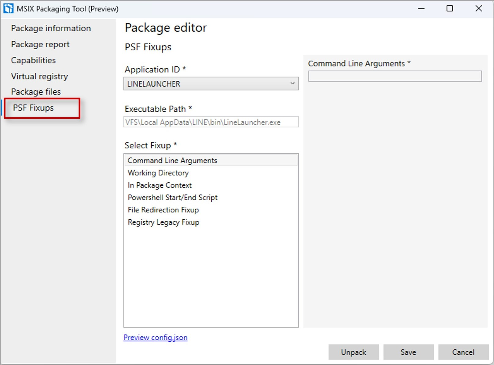

---
# Required metadata
# For more information, see https://review.learn.microsoft.com/en-us/help/platform/learn-editor-add-metadata?branch=main
# For valid values of ms.service, ms.prod, and ms.topic, see https://review.learn.microsoft.com/en-us/help/platform/metadata-taxonomies?branch=main

title:       Automated PSF config generation 
description: Integration of PSF with MSIX Packaging tool to simplify conversion by automating PSF config file generation
author:      fiza-microsoft # GitHub alias
ms.author:   fizaazmi # Microsoft alias
ms.topic:    article
ms.date:     10/06/2023
---

# Automated PSF config generation

This article talks about the integration of adding Package Support Framework (PSF) fixups with the MSIX Packaging Tool. This integration aims to simplify applying PSF fixups by automating the PSF config.json file generation, eliminating the need for manual configuration and reducing the potential for errors.

## Prerequisites

To try out this feature, download [MSIX Packaging Tool](https://www.microsoft.com/p/msix-packaging-tool/9n5lw3jbcxkf) from Microsoft Store 

### Automatically generate PSF config.json

To apply known fixups,

1. Launch the MSIX Packaging Tool, select to __Package Editor__ and navigate to the __PSF Fixups__ tab.

1. Select the __Application ID__ as present in the manifest. The Executable path will be populated automatically.

1. Select the __Fixup__ that you want to apply and fill all the mandatory parameters in the right pane.

1. You can review the configuration applied by clicking on __Preview config.json__ and then click on __Save__ to automatically apply the fixups.

  

>[!VIDEO 3cc16061-205e-409b-ab27-48fcd1373360]

### Supported PSF Features

#### 1. Application Fixups
>[!VIDEO a34d5fc5-1a5d-4b43-995d-c3271038ae3d]

-Working Directory
-Command Line Arguments 

#### 2. PowerShell Start/End Script 

>[!VIDEO 6a54e797-89f4-43df-a526-95c9625faa13]

#### 3. File Redirection Fixup 
-Package Relative

>[!VIDEO 5e1e2ccd-e444-4ded-a092-e715118c7da7]

-Package Drive Relative

>[!VIDEO 4ed29340-57f7-40f6-ab08-db6c3f6cffcf]

-Known Folder

>[!VIDEO 27299008-c0fa-4507-9ba6-7a0baad81dc0]

#### 4. Reg Legacy Fixup 

-ModifyKeyAccess

>[!VIDEO f42e8fbb-3e27-43d1-a82d-cc614e73f42f]

-FakeDelete

>[!VIDEO d1ca3935-a6b6-4d87-8638-acc16ef2fe77]

-DeletionMarker

>[!VIDEO 9a2321af-b3ae-498f-8d14-04aa626af615]

-Redirect

>[!VIDEO 190013af-c1af-4bec-a005-6cecc623f9dc]

#### 5. Environment Variable Fixup

>[!VIDEO 46417fed-8732-4735-bb85-7db856888e6f]

#### 6. Dynamic Library Fixup

>[!VIDEO cfa60160-9aef-4a28-93e4-2a25512044d8]

